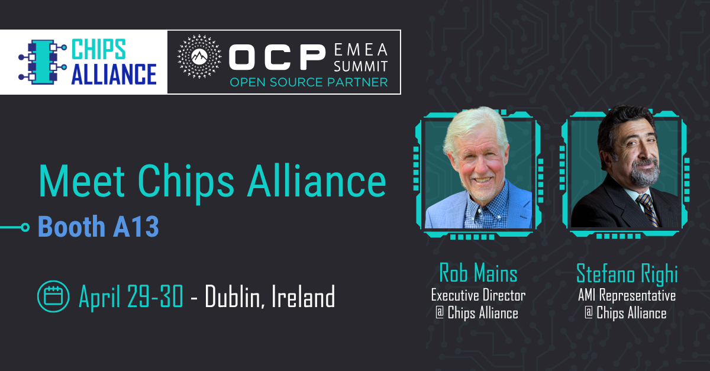

Heading to the Open Compute Project Foundation EMEA Summit, and looking to learn how open source silicon is accelerating chip design? Visit Rob Mains and Stefano Righi at booth A13.
CHIPS Alliance is proud to participate as an open source partner of the event.
We're looking forward to insightful discussions, sharing successes and challenges in collaborative hardware and firmware development, and connecting with the open compute community.

Don’t miss the **Caliptra** session on **April 30 at 09:50 (Level 1 – Liffey Hall 2).**

Join **Raghu Krishnamurthy, Bryan Kelly, Bharat Pillili, and Christopher Swenson** for a technical overview of the *Caliptra subsystem firmware stack*, an open source Root of Trust solution for data center-class SoCs. The session will highlight integration efforts, subsystem components, and the roadmap for Caliptra 2.0.

CHIPS Alliance welcomes participation and collaboration amongst companies, universities, and individuals.

Connect with Rob Mains and Stefano Righi here to pre-arrange a meeting, or visit them at booth A13 to learn about the latest developments and how to get involved.

Details [here ](https://www.opencompute.org/summit/emea-summit) 