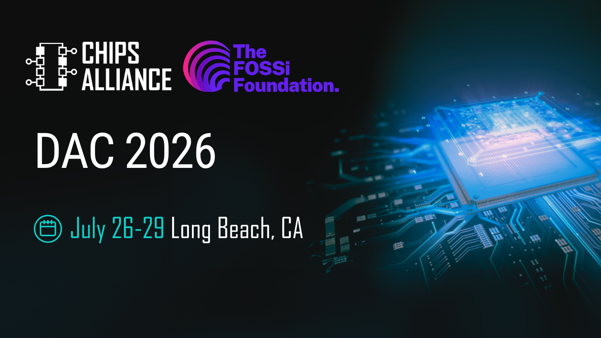

CHIPS Alliance will participate in the Open Source EDA, Data and Collaboration Birds-of-a-Feather session at DAC 2026 on July 28 in Long Beach, California.

The BoF will bring together academic researchers, industry practitioners, and open source maintainers for rapid-fire presentations, Q&A panels, and networking focused on Augmented AI in EDA, open source software and hardware, ecosystem governance, workforce development, and more.

The session will include presentations from CHIPS Alliance contributors. Stay tuned for more details, and [learn more>>](https://open-source-eda-birds-of-a-feather.github.io/)