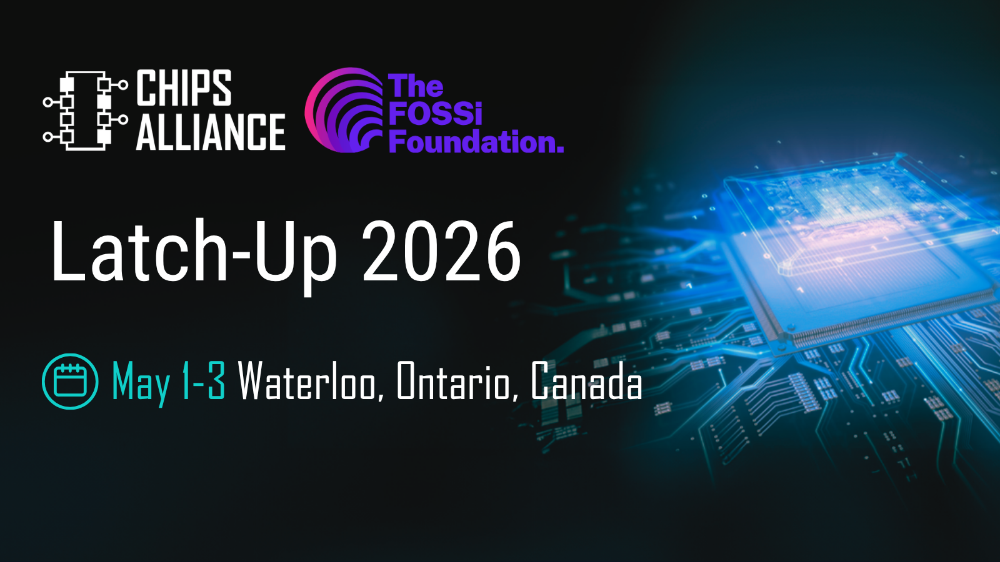

CHIPS Alliance is proud to sponsor [**Latch-Up 2026**](https://fossi-foundation.org/latch-up/2026), taking place May 1–3, 2026 in Waterloo, Ontario, Canada.

Organized by the FOSSi Foundation, Latch-Up is a weekend of presentations and networking dedicated to free and open source silicon.

Designed for the open source digital design community, it follows the model of its European counterpart ORConf, bringing together engineers, developers, and contributors to share work and connect across the ecosystem.