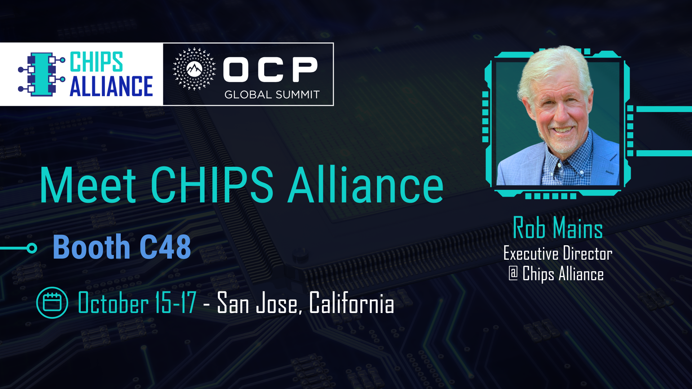

**CHIPS Alliance at the 2025 OCP Global Summit**
**October 13–16, 2025 | San Jose Convention Center**

CHIPS Alliance will be onsite at the [OCP Global Summit 2025](https://www.opencompute.org/summit/global-summit) to explore the latest advances in open silicon and hardware security. This year’s program features talks on **Caliptra**, the open source Root-of-Trust project highlighting its roadmap, security enhancements, cryptographic core, and integration into real-world cloud and platform environments.

You can also **meet CHIPS Alliance Executive Director Rob Mains at the OpenPOWER Foundation booth (C48)** to learn more about ongoing community efforts and how to get involved. See the talk details below. 

https://2025ocpglobal.fnvirtual.app/a/schedule/#view=calendar&title=caliptra
