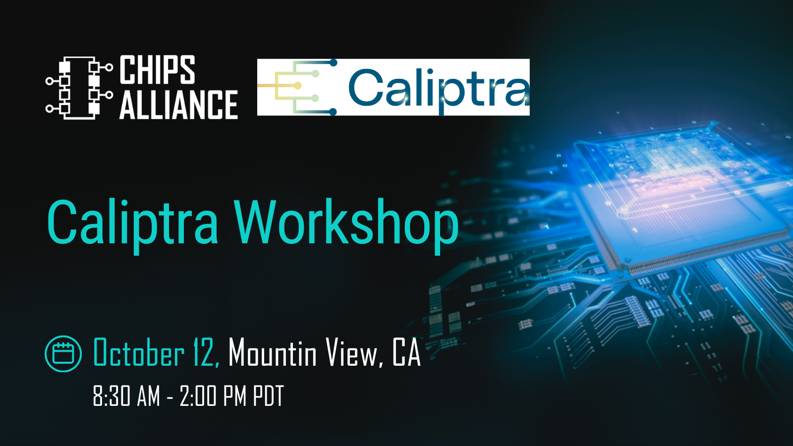

On October 12, the Caliptra community will gather in Mountain View for technical discussions on implementation experiences, ecosystem collaboration, and roadmap planning across the open source silicon security ecosystem. It’s an opportunity to learn from real-world deployments and discuss technical challenges with others working across the Caliptra ecosystem.    

The workshop runs from 8:30 AM–2:00 PM at Microsoft’s Mountain View campus, just before OCP Global Summit in San Jose. [Learn more and RSVP>>](https://forms.cloud.microsoft/pages/responsepage.aspx?id=v4j5cvGGr0GRqy180BHbR23di2uWAPRBmGnpahkFWfdUQ1pCRVBFUThYRTlRU0pRTTNTMk9EUjRJUi4u&route=shorturl)