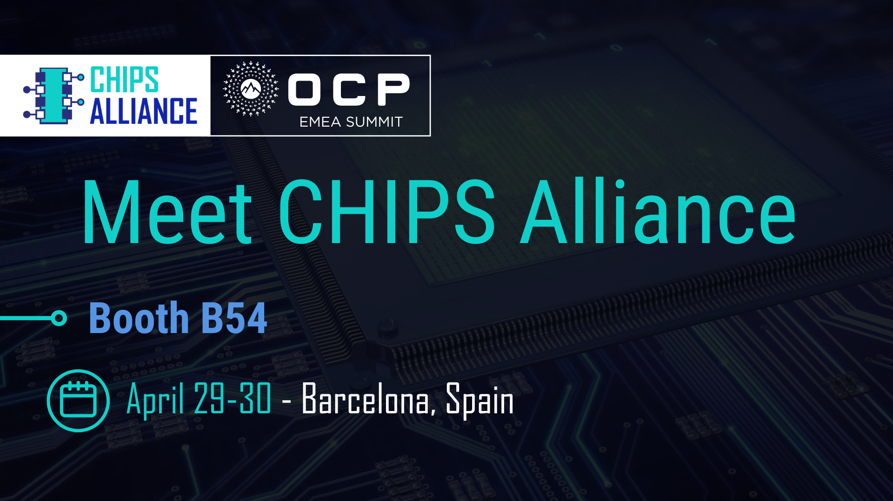

CHIPS Alliance will be onsite at 2026 OCP EMEA Summit, April 29–30, in Barcelona, Spain. Visit us at Booth B54, where we will be appearing alongside other Linux Foundation projects, SONiC and OPI. Representatives from Google and Antmicro will join the CHIPS Alliance team to discuss open source silicon development and demonstrate Guineveer, a RISC-V reference design. We look forward to connecting in Barcelona.

🔗 View the schedule: https://2026ocpemea.fnvirtual.app/a/schedule/