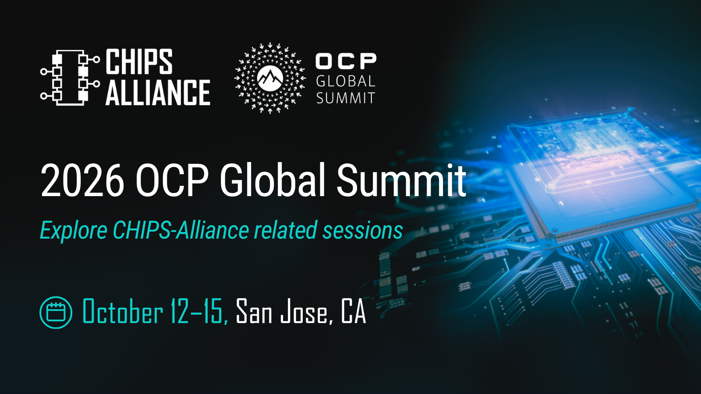

[2026 OCP Global Summit](https://www.opencompute.org/summit/global-summit) will be held October 12–15 in San Jose, California. Sessions related to the CHIPS Alliance Caliptra and VeeR projects will cover silicon roots of trust, device identity, secure key distribution, design verification, streaming boot, package-aware integrity and package-granular attestation, manageability, and certificate refresh.

CHIPS Alliance member organizations represented include AMD, Google, Intel, lowRISC, Marvell, Microsoft, NVIDIA, and Research Institutes of Sweden.

[View the full schedule >](https://www.opencompute.org/summit/global-summit/schedule-at-a-glance)