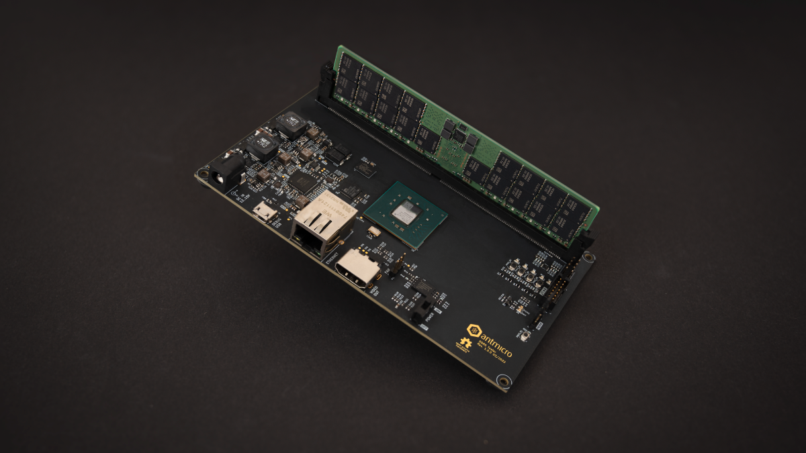

CHIPS Alliance is excited by the Antmicro announcement of the extensible, open, Rowhammer testing framework for DDR5. Read a detailed description of their work here: https://antmicro.com/blog/2022/08/extending-the-open-source-rowhammer-testing-framework-to-ddr5/

Here are some graphics of the work:

