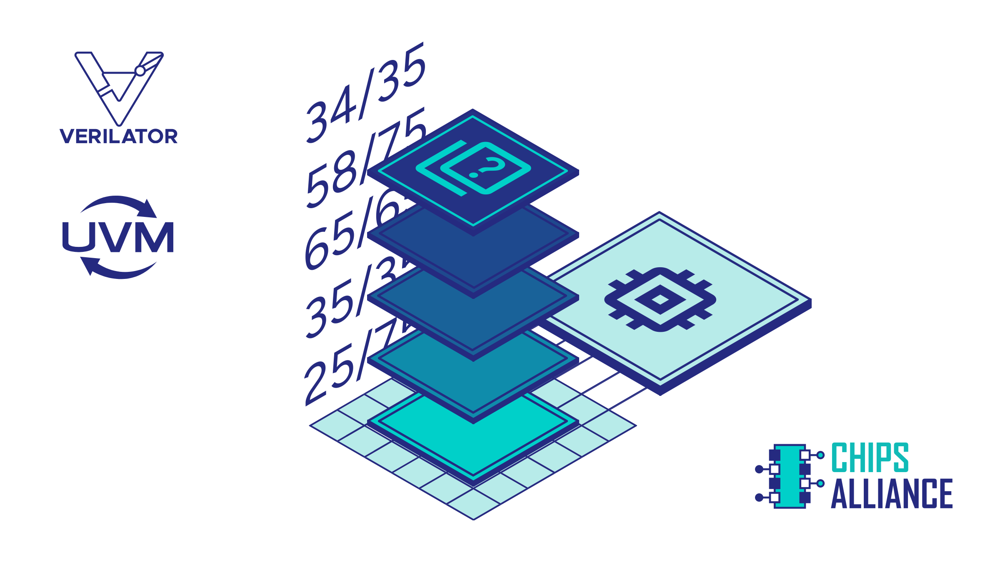
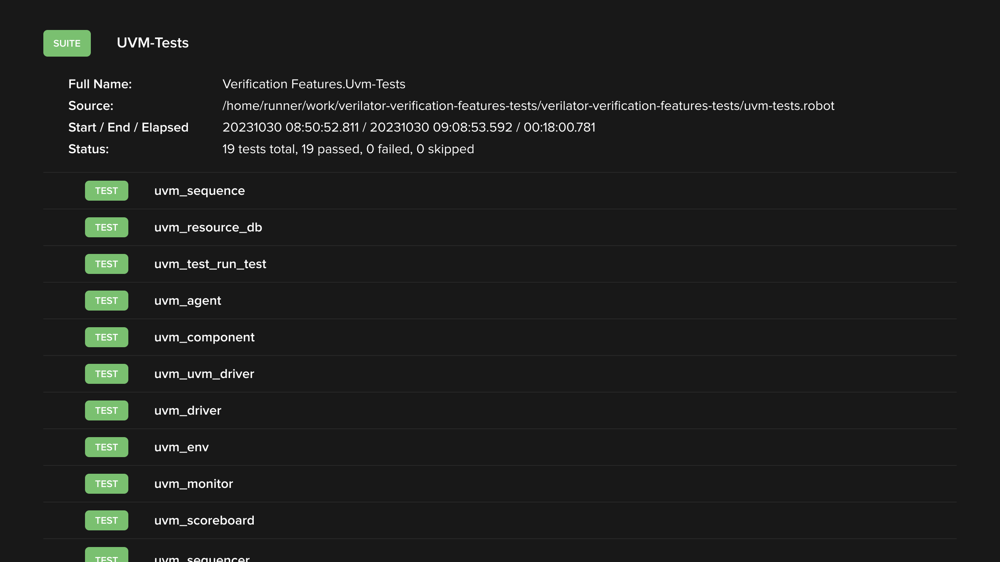

Leading the efforts of the Tools Workgroup in CHIPS Alliance, across a variety of customer projects, as well as its own R&D, Antmicro is actively looking for and capturing the productivity enhancements that can be achieved in ASIC design using open source. Developing and using open source-enhanced workflows is one thing, but in order for the general shift towards open source to happen, open source support for tooling and methodologies that are already prevalent across the chipmaking industry is necessary.

Bringing support for UVM (Universal Verification Methodology) in Verilator is a prime example of an effort to do just that. While Verilator has been integrated with other excellent open source verification tools like [cocotb](https://github.com/cocotb/cocotb) that Antmicro often uses for new projects, UVM remains the world’s most popular digital design verification methodology, already integrated with a variety of pre-existing workflows, tools and IP. The aim of the many-year effort to bring UVM capabilities into Verilator hopes to allow developers who, for various reasons, can’t be expected to migrate away from UVM to be able to run their testbenches in Verilator - quite a difficult endeavor, especially because of the size and intricacy of the methodology. 

With this note, Antmicro is happy to present an important milestone on this long journey: a proof-of-concept UVM testbench running in Verilator! This note will use this example to discuss some of the integration’s technicalities and describe the road towards this goal Antmicro has travelled so far, along with Google, Western Digital, and other CHIPS Alliance members, as well as future plans for comprehensive support.




### The previous milestones: dynamic scheduling, coroutines, unit tests

Since 2021, Antmicro has been gradually enabling capabilities necessary for specific parts of UVM to work with Verilator. As one of the first milestones on the way towards this goal, [enabling dynamic scheduling](https://antmicro.com/blog/2021/05/dynamic-scheduling-in-verilator/) (known in Verilator as “timing support”), allowed us to properly handle language constructs specifically designed for use in simulation by extending Verilator’s original, sequential evaluation loop with the ability to handle processes that dynamically react to simulation events. This change makes it possible to suspend execution of one SystemVerilog block while continuing execution of another, partially moving the scheduling from compilation to runtime.

By the end of 2021, Antmicro has been able to expand on this development by [using coroutines for the dynamic scheduler](https://antmicro.com/blog/2021/12/coroutines-for-dynamic-scheduling-in-verilator/). A coroutine is a generalization of the concept of a function, but with the difference that its execution can be paused at any point and resumed from any other point in the program (even from a different thread), making it possible to handle delays and events in SystemVerilog processes. Using coroutines enabled the implementation of dynamic scheduling without impact on simulation speed.

But this was just the foundation block for the real work, i.e. enabling actual UVM testbenches which would need the timing capabilities. In order to check whether particular UVM-related methods in Verilator are called as intended, we prepared a select set of [feature tests](https://antmicro.github.io/verilator-verification-features-tests/log.html#s1-s15) and used it as a burndown list to track the progress. 




### UVM-related contributions to Verilator

The work towards the current milestone has been multi-faceted, and as a result of the work on enabling initial UVM testbench support, Antmicro has contributed numerous developments to Verilator over the many months it took to get there.

To start with, Antmicro  added a `disable fork` statement that lets you terminate all child processes of a current process spawned using `fork`, as well as a `wait fork` statement that lets you wait for child processes of a current process to finish.

Antmicro  implemented support for using nonblocking assignments (NBA) in any function or task. Verilator used to disallow NBAs anywhere but directly in “always processes” or functions that get inlined in those processes. Using NBAs in class methods (or functions called from class methods) used to be impossible, but UVM indeed has an NBA in such a location, so they  had to implement it. They  did it by reusing timing constructs that are a part of the coroutines contribution mentioned earlier.

In order to allow for manipulating processes, Antmicro  added support for `std::process`, a built-in SystemVerilog class. Processes are SystemVerilog’s threads of execution – each process is run concurrently. `std::process` lets you stop such a process, wait for it to finish, or check its status. This also builds on the timing support mentioned in the previous section.

As another area that required new contributions, the team  needed to add support for a short-circuit evaluation mechanism. This mechanism ensures that the 2nd operand of a logical expression is evaluated only if required which lets us avoid wrong runtime behavior. Since logical expressions in Verilator are converted into bitwise expressions and short-circuit evaluation does not check such expressions, Antmicro added support by disabling the conversion only for expressions that have side effects as well as for when it may throw a segmentation fault due to uninitialized object handles.

Assigning event variables and event names was yet another new addition. This is significant because the behavior of event variables is akin to that of reference types, meaning that should you want to assign event A to event B and then trigger event A, the processes waiting on event B should wake up.

Modifying parent process variables in forks is now enabled as well. A process containing a local variable accessed by its child process can lead to accessing variables that no longer exist, e.g. when the parent process ends before its child accesses the variable. The original `fork` implementation only allowed such access in `fork..join`, and limited read access in other flavors of `fork` (in this case, the variable was copied to the child). These changes lift this limitation.

### First UVM testbench in Verilator

All the developments described in the sections above have enabled us to achieve the milestone of successfully running a [UVM memory testbench](https://github.com/antmicro/verilator-verification-features-tests/pull/421). The PR also extends the CI with a job running the testbench and adding the results to the [verification features tests dashboard](https://antmicro.github.io/verilator-verification-features-tests/log.html#s1-s14) thanks to the fact Antmicro  can now run it in the completely open source Verilator! The device under test here is a fairly simple memory block, but the testbench is using quite a few UVM features:

* uvm_agent
* uvm_test
* uvm_driver
* uvm_monitor
* uvm_scoreboard
* uvm_sequence and sequencer

Below, you can see a log from Verilator printed after a successful run.

```
VM_INFO ../src/base/uvm_root.svh(517) @ 0: reporter [NO_DPI_TSTNAME] UVM_NO_DPI defined--getting UVM_TESTNAME directly, without DPI
UVM_INFO @ 0: reporter [RNTST] Running test mem_wr_rd_test...
---------------------------------------
Name          Type          Size  Value
---------------------------------------
mem_seq_item  mem_seq_item  -     @212
  addr        integral      2     'h2
  wr_en       integral      1     'h1
  rd_en       integral      1     'h0
  wdata       integral      8     'h76
---------------------------------------
UVM_INFO hdl/mem_scoreboard.sv(59) @ 25000: uvm_test_top.env.mem_scb [mem_scoreboard] ------ :: WRITE DATA       :: ------
UVM_INFO hdl/mem_scoreboard.sv(60) @ 25000: uvm_test_top.env.mem_scb [mem_scoreboard] Addr: 2
UVM_INFO hdl/mem_scoreboard.sv(61) @ 25000: uvm_test_top.env.mem_scb [mem_scoreboard] Data: 76
UVM_INFO hdl/mem_scoreboard.sv(62) @ 25000: uvm_test_top.env.mem_scb [mem_scoreboard] ------------------------------------
UVM_INFO hdl/mem_base_test.sv(54) @ 25000: uvm_test_top [mem_wr_rd_test] ---------------------------------------
UVM_INFO hdl/mem_base_test.sv(55) @ 25000: uvm_test_top [mem_wr_rd_test] ----           TEST PASS           ----
UVM_INFO hdl/mem_base_test.sv(56) @ 25000: uvm_test_top [mem_wr_rd_test] ---------------------------------------
UVM_INFO ../src/base/uvm_report_server.svh(864) @ 25000: reporter [UVM/REPORT/SERVER]
--- UVM Report Summary ---

** Report counts by severity
UVM_INFO :   11
UVM_WARNING :   24
UVM_ERROR :    0
UVM_FATAL :    0
** Report counts by id
[NO_DPI_TSTNAME]     1
[RNTST]     1
[UVM/COMP/NAME]    24
[UVM/COMP/NAMECHECK]     1
[UVM/RELNOTES]     1
[mem_scoreboard]     4
[mem_wr_rd_test]     3
```

As you can see, all good! Antmicro is working on enabling a broader set of testbenches over time, which will of course require extensive effort, perhaps more so than what has been done so far, but with this end-to-end workflow in our arsenal, the endeavor becomes much easier to reason about and break up into smaller pieces.  The ability to run UVM testbenches with open source tools will contribute to open sourcing of more testbenches as such. This, in turn, should allow Antmicro  to incrementally build out the UVM support as needed.

If you’d like to run the test locally, you can simply build and install the latest mainline Verilator, download the test code and run the simulation. Please refer to [Verilator’s documentation](https://verilator.org/guide/latest/install.html#detailed-build-instructions) for a detailed guide on how to build and install the tool. To run the example run:

```
git clone https://github.com/antmicro/verilator-verification-features-tests.git
cd verilator-verification-features-tests
git submodule update --init --recursive uvm
cd tests/uvm-testbenches/mem-tb
make 
```

The last command will Verilate all the required SystemVerilog code - the tested memory block, testbench and UVM library, compile the generated C++ code and run the resulting binary. You should see output similar to the one listed above.

Goes without saying, all this would not have been possible without collaboration with Wilson Snyder, Geza Lore and other people contributing to Verilator, as well as the considerable involvement of Western Digital.

### UVM testbenches in fully open source development

While successfully running this proof-of-concept UVM testbench in Verilator is a significant milestone, Antmicro’s goal in this area is now to expand on it and enable comprehensive UVM testbench support in the framework. One of the next heavy lifts is to enable full support for constraint randomization. Currently, Verilator supports only simple constraining and implementing support for complex scenarios requires integration of a solver capable of parsing, processing and resolving SystemVerilog constraints to ensure random functions only return legal values.

To learn more about enabling UVM testbenches in Verilator, join Antmicro at the next [CHIPS Alliance Technology Update] (https://events.linuxfoundation.org/chips-biannual-technology-update/) on November 9, either virtually or on-site at Google MAT1 Building, Sunnyvale.   

If you would like Antmicro to develop bespoke UVM testbenches for your use case, include them in your HDL simulation in Verilator, and even shift your projects to a fully comprehensive open source workflow via integrations with [Renode](https://renode.io) and a plethora of other open source tools in Antmicro’s portfolio, feel free to reach out at [contact@antmicro.com](mailto:contact@antmicro.com).
