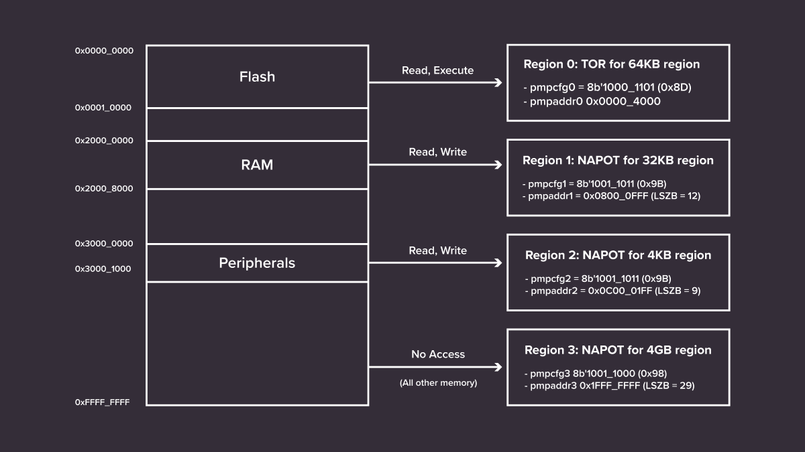
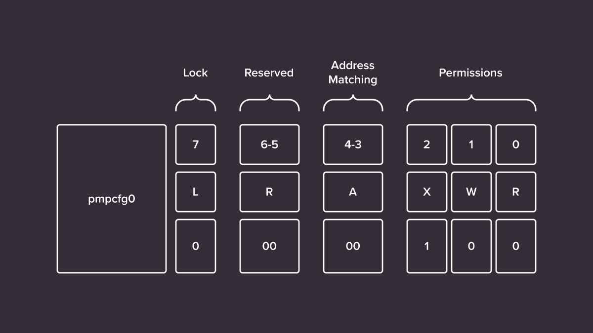
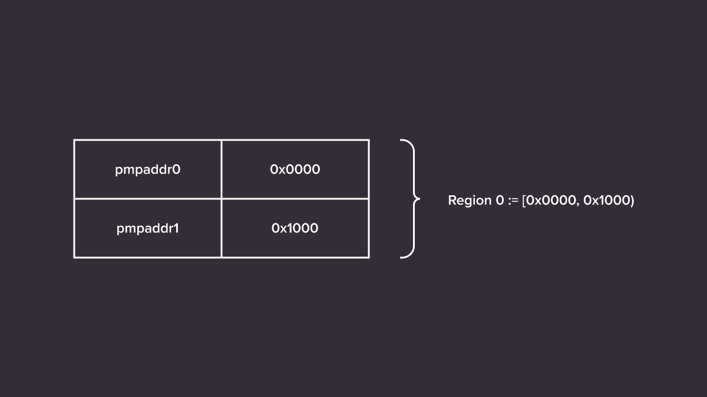
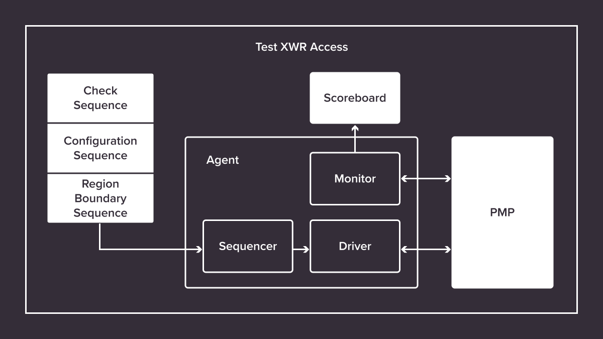

Antmicro’s work with CHIPS Alliance’s [Caliptra Root of Trust](https://github.com/chipsalliance/Caliptra) project, led by Google, AMD, NVIDIA, and Microsoft focuses around providing [automated testing and verification infrastructure](https://opensource.googleblog.com/2023/11/open-source-and-ci-driven-rtl-testing-and-verification-caliptra-risc-v-veer-core.html) including code quality checks, code indexing, coverage and functional testing pipelines, as well as maintaining and enhancing the RISC-V VeeR EL2 core which sits in the middle of the Caliptra design. As providers of commercial engineering services around open source tools and silicon blocks, working on Caliptra gives Antmicro both a solid starting point for assisting customers with practical RoT implementations as well as a template for CI-driven ASIC development. 

The most recent feature requested by the Caliptra working group was the addition of Physical Memory Protection (PMP) to the VeeR EL2 Core according to the [specification](https://github.com/riscv/riscv-isa-manual/releases/download/riscv-isa-release-1239329-2023-05-23/riscv-privileged.pdf) ratified by [RISC-V International](https://riscv.org/). This article outlines how the principles of the PMP specification were mapped to the VeeR implementation and tested with both pyUVM and system software, as an example of how RISC-V enables collaborative and transparent development of core IP.

## Principles of RISC-V PMP

Physical Memory Protection is a mechanism that divides the system address map into regions with configurable permissions. In the case of RISC-V cores, the PMP configuration for each region is held in additional Control and Status Registers: `pmpcfgX` and `pmpaddrX`, with the maximum allowance of 64 regions. The `pmpaddrX` register holds an address which represents the region’s boundary, whilst the `pmpcfgX` configuration register is used to encode a locked bit, address matching and permissions. 

The lock bit mechanism is an interesting feature of the RISC-V PMP spec – it can be set to prevent overwriting the contents of the configuration registers until the next hardware reset of the CPU. This is a crucial feature to prevent software from applying unwanted modifications to the state of the PMP configuration.

Address matching refers to the way boundaries of memory regions are calculated, with three available modes in case of PMP: 

* Naturally aligned power-of-2 (NAPOT) 
* Naturally aligned four-byte (NA4)
* Top boundary of an arbitrary range (TOR)

As an example, consider Region 0 in the image below. Address matching in `pmpcfg0` is set to `2’b00` (TOR) and `pmpaddr0` is set to `0x4000` (16kB). The lower boundary of the first region is always `0`, and the upper boundary, in case of TOR, is calculated directly from the pmpaddr0, and is equal to `pmpaddr0 << 2 =0x10000 (64kB)`. This is because the address stored in the address register represents bits [33:2] of the physical address space. 
Regions form a continuous space, so one region’s upper boundary is always the lower boundary for the next region. In case of Region 1, which uses the NAPOT encoding (A=2’b11), the number of the least significant, set bits is relevant, e.g. if `pmpaddr1 = 0x0800_0FFF`, then 12 least significant bits are set and the upper boundary is calculated as 2^(12+3)=32kB. The smallest encodable region is a 4-byte range, where the extra `3` accounts for 4-byte and 8-byte regions.

For each region, an execute, write and read permission may be set. Attempting to perform a prohibited action with data under any of the protected addresses results in a precisely trapped exception.

## PMP VeeR EL2 implementation details

To look at how PMP generally operates, suppose that a program is being executed by a RISC-V core and the next instruction in line is an addition instruction – ADD. For simplicity’s sake, we can also assume that all relevant instructions and addresses are present in the `instruction cache`. In a conventional implementation, the core increments the `program counter` and fetches the instruction in a process of reading the content of a memory cell at the PC address. Typically the instruction is passed to the decoder logic, which is capable of discerning between different types of instructions, e.g. addition, subtraction, multiplication, etc. PMP however, when enabled, makes a check before decoding the instruction, to ensure that its execution is allowed.

The following steps of the check procedure are straight-forward. First, the address matching configuration (bits 4,3) is read from the PMP CSRs, followed by a search for address PC in the defined `regions` – each pair of entries in the configuration registers represents boundaries of a `region`, e.g. if `address matching` is set to TOR and address registers store values 0x0000 and 0x1000, respectively, then the defined `region` covers all addresses between these 2 values (left-closed).

Once a matching `region` is found, the 3 least significant bits of the corresponding PMP configuration register are read to decode permission type:

* Bit 2 (X) - if set, then execution is permissible
* Bit 1 (W) - if set, then write (store instruction) is permissible
* Bit 0 (R) - if set, then read (load instruction) is permissible.

The configuration is intuitive, as it resembles `chmod`’s XWR permissions used in operating systems for file management.

## Testing PMP for the VeeR EL2 core with pyUVM

Universal Verification Methodology (UVM) is an industry-wide standard of writing testbenches of hardware modules implemented in Verilog, also used within the Caliptra project. While Antmicro is actively developing UVM integrations with open source tools [such as Verilator, with very promising results](https://antmicro.com/blog/2023/10/running-simple-uvm-testbenches-in-verilator/), there is still work involved to enable all of UVM running open source directly in SystemVerilog. For the time being, much of the testing for this project was performed using [pyUVM](https://github.com/pyuvm/pyuvm), a Pythonic fork of UVM, which both enables completely open source verification and lets you use modern features of Python to simplify implementation and remove boiler-plate code from tests. 

Concurrently with the RTL implementation of the PMP module, we developed pyUVM tests to verify its correctness. The basic testing scenario was to first configure the mode and address regions, and then perform an arbitrary number of memory accesses of different types.
 
To validate PMP behavior thoroughly, several angles have to be considered; most obviously, we can set up the configuration or memory accesses so as to violate the rules and observe the raised exceptions; or conversely, set up for and expect a success. Some features of the configuration space can be tested independently: a directed test can be constructed to test the lock mechanism. Furthermore, the execute permission is only relevant during instruction fetches, while read and write permissions are only checked during loads and stores, which means that the features can be tested separately in unit tests as well as together in integration tests.

As an example of a VeeR EL2 PMP UVM test, let us take a look at [test_xwr_access](https://github.com/chipsalliance/Cores-VeeR-EL2/tree/main/verification/block/pmp). One of the first tasks in testbench design is to define stimulus patterns, which will match a use case of the device as closely as possible. To put it simply, using PMP boils down to setting boundaries of address Regions by writing to `pmpaddrX` CSRs, configuring the PMP behavior by writing to `pmpcfgX` CSRs, and running memory access checks. In UVM, a discernible stimulus pattern is called a `sequence`, and in the most basic scenario in the `xwr_access` test, three `sequences` are created to configure and test the PMP. The first `sequence`, `Region Boundaries Sequence`, is responsible for setup of the `pmpaddrX` registers and is followed by a `Configuration Sequence`, which sets up the `pmpcfgX` registers. The third and final `sequence` is a stream of randomized accesses, which represent the fetches, loads and stores that the CPU would normally perform. In general, any number of `sequences` can be fed into the `sequencer` to create meaningful tests for more advanced use cases. 

The architecture of the test is relatively straightforward for developers familiar with UVM testbenches. While the `sequencer` is used to store a `sequence` of test items in correct order, it is the `driver`, which is responsible for applying the stimulus to the Device Under Test (DUT), in this case the developed PMP module. `Monitor` and `scoreboard` are the UVM Objects which provide the analysis and verification capabilities to the testbench – the former monitors both the input and output ports and pushes the collected data to the latter. In the `scoreboard` object, a reference prediction model is implemented to compare the received data with expectations.

## Software execution tests
 
The modified, PMP-capable implementation of VeeR EL2 still passes the original tests Antmicro had developed for the testing of the Caliptra/VeeR implementation, including the [RISCOF](https://github.com/riscv-software-src/riscof) and [riscv-dv](https://github.com/chipsalliance/riscv-dv) tests described in [the previous article](https://opensource.googleblog.com/2023/11/open-source-and-ci-driven-rtl-testing-and-verification-caliptra-risc-v-veer-core.html), which proves that the new implementation does not have side effects. 

In order to exercise the PMP implementation further, Antmicro wrote a simple [software execution test](https://github.com/chipsalliance/Cores-VeeR-EL2/blob/main/testbench/tests/pmp/main.c), which configures the PMP’s control and status registers and runs simple code to test fetches, loads and stores. A custom trap handler was developed to catch raised exceptions and validate both allowed and prohibited accesses.

The team also ran tests for the VeeR EL2 core and the PMP implementation using [Cascade](https://comsec.ethz.ch/research/hardware-design-security/cascade-cpu-fuzzing-via-intricate-program-generation/), a RISC-V CPU fuzzer recently released by COMSEC, the computer security group of the Department of Information Technology and Electrical Engineering (D-ITET) at ETH Zürich. Cascade is designed to overcome pitfalls of other existing solutions by testing intricate control flows and much longer programs – you can find detailed information about it in [a recent publication](https://comsec.ethz.ch/wp-content/files/cascade_sec24.pdf). With the help of this tool, ETHZ managed to uncover an interesting corner case where a `FENCE` or `FENCE.I` instruction with non-zero arguments could cause the VeeR EL2 core to hang, as these instructions were flagged as illegal. Antmicro was able to quickly remedy the issue, and now these instructions are ignored by the core as permissible by the RISC-V specification.

## Design and adapt secure FPGA and ASIC based solutions with Antmicro

As demonstrated by the use of the VeeR project in the [Caliptra Root of Trust](https://github.com/chipsalliance/Caliptra), the adaptability of open source cores, combined with testing capabilities offered by open source tools, provides the transparency, scalability and vertical integration necessary for emerging use cases such as [dedicated secure ML silicon](https://antmicro.com/blog/2023/11/secure-open-source-ml-with-open-se-cura/) as well as collaborative environments with multiple actors involved, such as the data center. 

Whether you are looking to adapt open source RISC-V cores to your security-focused use case, or to harness the possibilities of using open source tooling for chip design, you can take advantage of Antmicro’s proven expertise and a portfolio of adaptable, extendible open source components and frameworks. For wider context, make sure to watch a [presentation from ORConf 2023](https://www.youtube.com/watch?v=DFCWthwXzbk), and to discuss your particular needs, feel free to contact them at [contact@antmicro.com](mailto:contact@antmicro.com).
