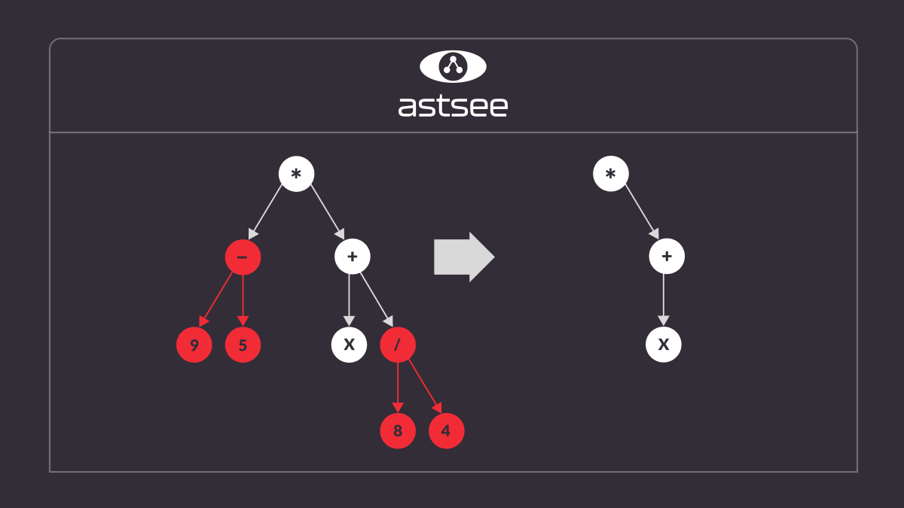
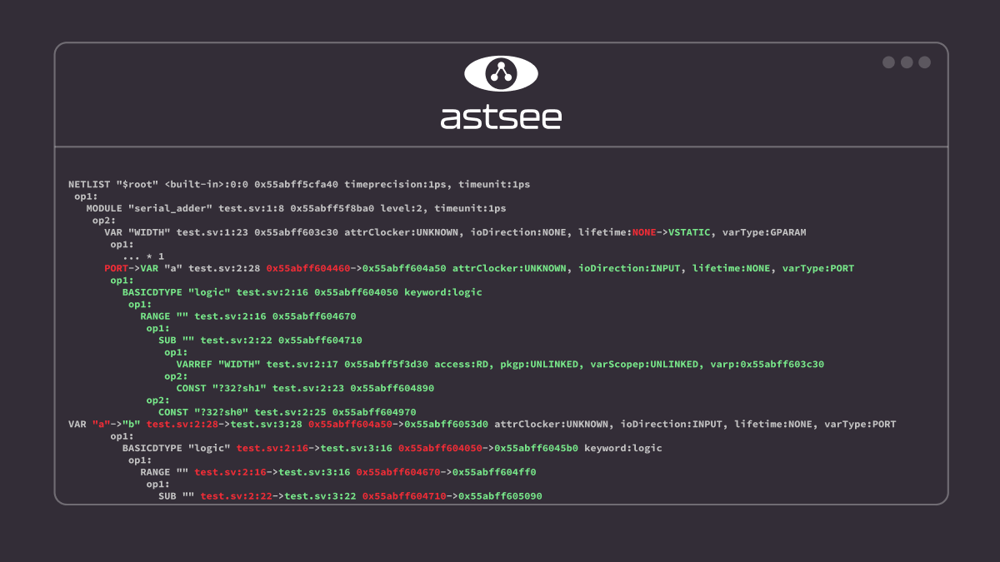
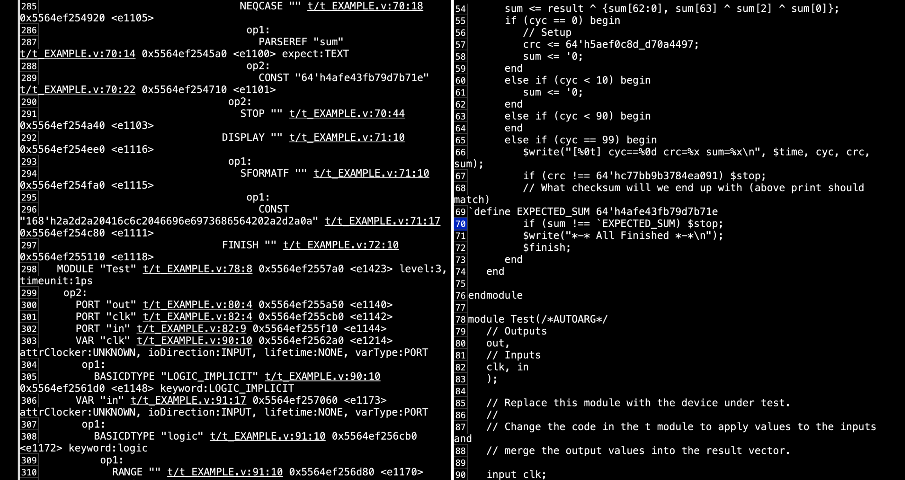
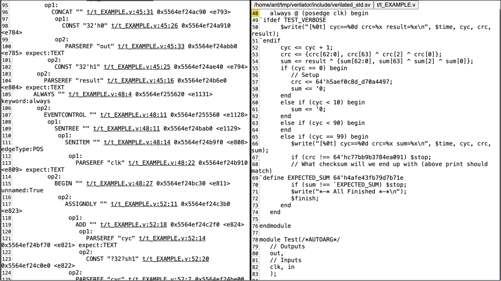

Among other things, Antmicro’s work towards improving the vertical integration potential of customers designing ASIC solutions often sees them enhance one of the flagship open source projects in this space, Verilator which complements - and in fact is [often used alongside](https://antmicro.com/blog/2023/09/dpi-support-in-renode-for-hdl-co-simulation-with-verilator-and-questa/) - Antmicro’s own functional simulation framework, [Renode](https://about.renode.io). Besides contributing bug fixes and other quality-of-life improvements into Verilator, Antmicro also develops new functionalities that [expand its use cases towards e.g. UVM verification](https://antmicro.com/blog/2023/10/running-simple-uvm-testbenches-in-verilator/) and [continuously improve overall performance](https://antmicro.com/blog/2023/09/accelerating-model-generation-in-verilator/).

In this blog article, Antmicro  describes some of the recent developments for Verilator - the –dump-tree-json flag and the new software suite called astsee, which provides a good foundation for developing new, advanced features for Verilator as well as debugging the simulator itself through the ability to look inside the verilation process as it unfolds. 

## Peek into verilation at each stage with –dump-tree-json

The process at the core of Verilator, called verilation, involves going from the original HDL code into corresponding C++ (which is later used to simulate the design) The first stage of this process aims at producing a structured representation of SystemVerilog code in the form of an Abstract Syntax Tree (AST) representation of the design before dozens of subsequent stages that parse the code, resolve references, resolve signal widths and perform various optimizations. 

Finally, the AST is emitted as C++ code, which can then be compiled into a simulation binary. The stages related to scheduling play a crucial role here, as they convert the original AST from a more dataflow-like structure to an imperative one. 

For debugging purposes, it can be useful to look inside the process of verilation in order to find errors. This is why Antmicro developed a new --dump-tree-json flag for Verilator, which can dump the AST from each verilation stage into a JSON representation, making it much easier to find the individual point of failure during the verilation process and to fix it accordingly. The flag offers more fine-grained control over the output than the preexisting --xml-only flag (by e.g. letting you examine the output of specific stages), and allows to analyze the output using a more modern format.

The advantage of using JSON is that - thanks to its popularity in web development, cloud and other fields - it is widely supported in the open source ecosystem through various tools, viewers and converters. JSON is also leaner and easier to read and the output from --dump-tree-json can therefore be handled in a variety of useful ways, including through our newly introduced astsee tool, described below.

## Introducing astsee

While being able to access raw JSON output from each verilation stage is useful, it still remains difficult to see patterns and points of failure when working with very large, complex and state-of the-art designs. This is particularly true when helping customers build production-grade chips that require incredible amounts of long-turnaround, compute-heavy workloads. 

To get more insight into the internals of Verilator in their work, Antmicro developed [the astsee suite](https://github.com/antmicro/astsee), which provides a comprehensive toolkit for pretty-printing, diffing, and exploring ASTs from a wide range of sources (including, but not limited to, Verilator). Astsee can generate an interactive HTML document from JSON output with a diff view, which provides a way to easily compare the original AST dump with the JSON representation. It is also possible to view two generated JSON dumps and compare them. One particularly useful feature of astsee is the ability to highlight a given part of the output in one pane when comparing AST to JSON, which will automatically highlight the same output on the other pane. 

Astsee also works as a plugin within [GDB](https://www.sourceware.org/gdb/), which allows users to invoke it for more granular dumps during the process of debugging in Verilator. Users can choose to execute astsee at any point during the verilation process, not only at the end of an individual stage, providing the possibility to identify and eradicate bugs that emerge during each stage of verilation. Currently, astsee only supports generic JSON trees, but support can be easily extended to other ASTs that have been exported into different formats as the suite operates functionally independently of other software. 

Support for Verilator is specifically provided through [astsee_verilator](https://github.com/antmicro/astsee/blob/main/astsee/verilator_cli.py), a tool which harnesses the power of astsee and Verilator using the JSON dumps obtained from the aforementioned --dump-tree-json tool. This tool also helps analyze individual nodes within the generated AST, as they can contain multiple different and important values such as pointers and data types. With this specific knowledge of how the node is composed, it is possible to compare fields separately. Astsee therefore provides tangible benefits in terms of reducing development time, as it provides the Verilator AST output in a clean and structured order which can then be modified as required without requiring difficult and time consuming comparisons. 

## Future plans

We are working on pushing [the support for JSON dumps into mainline Verilator](https://github.com/verilator/verilator/pull/4715), and as a result of the discussions sparked by this work, it is possible that at some point Verilator will use JSON as the default serialization format, replacing the existing XML output and the --xml-only flag. 

Since Antmicro is developing and optimizing a variety of tools as part of their work on a broad range of ASIC/FPGA, AI and hardware solutions for their customers, they will be able to use the fact that the astsee tooling suite is software agnostic to enable support/processing of ASTs generated in other use cases. The HTML and diff views are not dependent on the JSON format, and can be easily extended to output in XML or other proprietary formats. 

## Customized Verilator tools for improving FPGA/AISC and hardware design workflows

Antmicro develops a wide range of specialized tools that improve collaborative workflows, and helps customers integrate Verilator into their existing workflows. Adopting Verilator for ASIC simulation and verification offers the advantage of infinite cloud scaling, [especially for very large designs](https://antmicro.com/blog/2022/11/scaling-verilator-for-very-large-designs/). 

Get in touch at [contact@antmicro.com](mailto:contact@antmicro.com) to find out more about how Antmicro can help you adopt Verilator and other open source tools to increase the productivity of your ASIC design teams.
