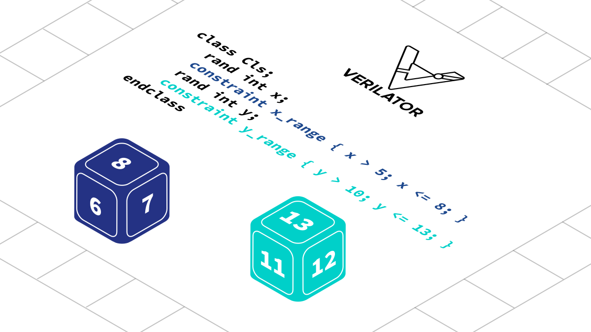

Digital design verification often utilizes the so-called constrained randomization functionality offered by SystemVerilog, where in order to efficiently test designs with random but still correct data, a digital logic designer can put constraints in place. This allows verification tests to run shorter by focusing the validation of the design’s behavior on input that the designer considers useful and interesting.

A few months ago Antmicro [introduced constrained randomization to Verilator](https://antmicro.com/blog/2024/03/introducing-constrained-randomization-in-verilator/)  - another significant milestone on the way towards full open source support for SystemVerilog and industry-prevalent [UVM testbenches](https://antmicro.com/blog/2023/10/running-simple-uvm-testbenches-in-verilator/). This work has been highly anticipated by many industrial users and is allowing Antmicro to slowly but steadily adopt Verilator for UVM-style verification in their state of the art silicon development work like CHIPS Alliance’s [Caliptra Root of Trust](https://github.com/chipsalliance/Caliptra) project.

With this article, in order to shed more light on the progress and the internals of Antmicro’s approach, we take a deeper dive into the role of Satisfiability Modulo Theories (SMT) solvers (such as [z3](https://github.com/Z3Prover/z3) and [cvc5](https://cvc5.github.io/)) in the implementation of randomization constraints, conversion of SystemVerilog expressions to the [SMT-LIB2](https://smt-lib.org/) language, the details of the integration of the solvers into Verilator, as well as considerations for further extending the SystemVerilog support.



### SystemVerilog to SMT-LIB2

The current solution that Antmicro [introduced to upstream  Verilator](https://github.com/verilator/verilator/pull/4947) involves converting SystemVerilog expressions to SMT-LIB2, a Lisp-like language that describes Satisfiability Modulo Theories (SMT) problems in terms of functions (variables are 0-argument functions in SMT), and constraints (“assertions” in SMT jargon).

Presented below is a sample problem statement for integer factorization in the SMT-LIB2 language:

```lisp
(set-option :produce-models true)
(set-logic QF_BV)
(declare-fun x () (_ BitVec 32))
(declare-fun y () (_ BitVec 32))
(declare-fun z () (_ BitVec 32))
(assert (= #x00006161 z))
(assert (= (bvmul x y) z))
(assert (and (bvult x z) (bvult y z)))
(assert (bvult x y))
(check-sat)
```

To which an SMT-LIB2 compliant solver will respond, confirming that the stated problem is satisfiable:

```
sat
```

It can then be queried about the exact solution:

```
(get-value (x y))
```

And then the solver will respond with an actual factorization it has found:

```lisp
((x #x00000061)
   (y #x00000101))
```

### Implementation

The integer factorization problem from the section above can be expressed as a SystemVerilog class, for example:

```systemverilog
class Cls;
    rand bit [31:0] x, y, z;
    constraint factor {
        z == 32’h6161;
        x * y == z;
        x < z && y < z;
    }
    constraint stable {
        x < y;
    }
endclass
```

If we call the randomize method on an instance of `Cls`, the constraints are first converted to strings in the SMT-LIB2 format, which Antmicro implemented using the `$sformatf` system function, converting every sub-expression to a solver-digestible string (e.g. `LHS && RHS` to `$sformatf(“(and %s %s)”, LHS, RHS)`). Thanks to constant folding in Verilator, the nested expressions are normalized to a single `$sformatf` call with just the missing bits left to be filled in at runtime. 

Like in Verilator, there are separate functions in the language for signed and unsigned operations on bit vectors. But unlike in SystemVerilog, there are no ‘signed’ and ‘unsigned’ bit vectors - the signedness is determined by the operation, which uses acronyms such as `bvslt` for “bit vector signed less than”, and `bvult` for “bit vector unsigned less than”. Each constraint is converted to a separate function that is called when the constraints are gathered.

### Advantages

Fine-grained control over the communication with the solver and over the passed expressions let Antmicro ensure that the results can get truly random values, even in narrow solution spaces (which is an improvement over [the previous proof of concept implementation](https://antmicro.com/blog/2023/01/open-source-systemverilog-uvm-support-in-verilator/#improving-existing-verilator-features)). Solvers are typically deterministic, which is a generally desired feature, except of course when you do want to achieve randomization. Therefore, they decided to add an extra artificial constraint to further narrow down the solution space. The constraint is constructed by forcing a random hash of output variables and forcing it to a random value. A subset of all output bits is selected, XORed together, and an extra `assert` command is issued forcing the solver to find a different solution, and aiming to introduce enough entropy to its internal state to explore the solution space thoroughly.

### Future considerations: state-dependent and conditional constraints

State-dependent and conditional constraints, as well as constraints on arrays, are the next possible steps on the way to full constrained randomization support. In order to support arrays, each element should become a separate variable, which requires a relatively complex implementation. Support for dynamic (state-dependent) constraints is currently in progress.

The next potential improvements also include the way 1-bit vectors and booleans are handled. They are currently undistinguishable in Verilator, but they are treated as separate ‘kinds’ in SMT-LIB2 and cannot be mixed. This shortcoming does not surface in most cases, but should you stumble upon it in your design, adding `== 1‘b1` to convert a 1-bit vector to a boolean is a possible workaround. 

### Integrate open and efficient ASIC verification into your workflows with Antmicro

With the effort described above and [others before it](https://antmicro.com/blog/tags/verilator/), developed in part under the guise of the EU-funded [TRISTAN project](https://tristan-project.eu/) concerned with open RISC-V SoC development tooling, Antmicro steadily pushes Verilator towards full SystemVerilog support, with the goal of enabling efficient, fully open source verification workflows for complex ASIC projects. 

To discuss adoption of the open source toolkit and methodology in your ASIC design verification flows and expanding SystemVerilog and UVM support to benefit your projects, reach out to Antmicro at [contact@antmicro.com](mailto:contact@antmicro.com).
