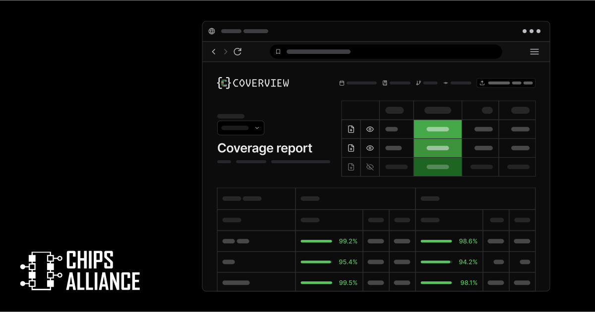
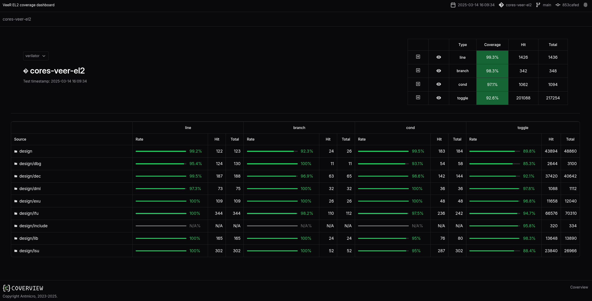

Code coverage is a useful metric to keep track of while developing test suites, providing engineering teams with an actionable overview of how broad their testing goes. This is true both for executable code and digital design, but the different nature of RTL and software execution requires developers to look at different types of coverage information. On top of tracking executed code lines and visited branches, RTL coverage will also need to include information e.g. about specific bit field toggles of all the signals in the design. The thorough testing of a sufficient number of combinations of those signals can be the “make or break” for an RTL design.

In order to facilitate automated generation of interactive coverage dashboards for various internal and customer projects of growing complexity, Antmicro developed [Coverview](https://github.com/antmicro/coverview). Coverview is an open source tool that lets you aggregate RTL and other test execution results as a single page in a clear, unified form, with comparative analysis and introspection capabilities as well as the ability to load data incrementally. It enables digesting output from different sources, including RTL simulators, can be deployed as a static webpage and integrated with existing CI/CD pipelines.

In this article Antmicro provides an overview of Coverview's features and illustrate it with an example of a dashboard generated for the [VeeR EL2 core](https://chipsalliance.github.io/Cores-VeeR-EL2/html/main/coverage_dashboard/all/#/) project they are maintaining for the [Caliptra](https://github.com/chipsalliance/caliptra-rtl) working group of [CHIPS Alliance](https://chipsalliance.org/).

### Versatile coverage reporting with Coverview

Coverview utilizes several sources of information: the [LCOV](https://github.com/linux-test-project/lcov) (Linux Coverage Visualizer) format (`.info` files), the source of the project being analyzed as well as a custom `.desc` format, similar to `.info`, but containing information on which test covers a specific line. It aggregates multiple coverage types into a single-page, unified dashboard.

Coverview was built to cover a variety of use cases involving both public and private dashboards, in different CI and data storage setups. Thus, it can generate a self-contained dashboard with embedded data, or you can simply [load a specially crafted .zip archive](https://github.com/antmicro/coverview?tab=readme-ov-file#data-structure) to load coverage data in runtime - for this purpose Antmicro released a [Coverview version deployed on GitHub pages](https://antmicro.github.io/coverview/index.html#/) which you can start using right away.

This lets you either generate standalone dashboards that get deployed with your code - useful for simpler CI pipelines where you just upload everything into one specific place/bucket, or create more advanced setups where you can navigate different datasets by simply switching an URL parameter. A built-in multi-dataset capability with a dropdown also lets you compare multiple data sources in one.

Take a look at the [project's README](https://github.com/antmicro/coverview?tab=readme-ov-file) for basic usage instructions.

You can also check out the complementary [info-process](https://github.com/antmicro/info-process) tool which simplifies the process of creating Coverview input archives, including aggregating multiple `.info` files into one.

### Generating coverage dashboards for RTL projects

Coverview's primary initial use case was for ASIC design - to enable actionable insights into verification status of open source RTL development in collaborative scenarios which CHIPS Alliance enables.

It can be used to process results from different RTL simulators, such as but not limited to the open source Verilator in a variety of contexts including verification.

It includes a burndown list functionality to show which parts of the design need more urgent attention, drill-down individual file views with expandable signal lists, as well as tooltip links to specific tests covering the analyzed object.

The feature set is developed generically to avoid overfitting to the specific ASIC use case, e.g. supported coverage types are configurable.

For RTL development projects, four types of coverage are currently enabled:

* line - shows which lines were executed
* branch - evaluates statements such as if-else or ternary operators in both true and false cases
* toggle - shows whether a signal is toggled between `0` and `1` and back in order to ensure that transitions of all bits in a signal were covered
* condition - summarizes coverage of all combinations of conditions for a given expression

Coverview is already deployed in several RTL projects - including the [VeeR EL2 core](https://chipsalliance.github.io/Cores-VeeR-EL2/html/main/coverage_dashboard/all/#/) mentioned earlier - and Antmicro are working on adapting it to cover other use cases such as software simulation using [Renode](https://offering.antmicro.com/#/re-renode#overview).

### Comprehensive testing and verification

Thanks to its open source nature, Coverview can be easily extended and customized to match your specific use case, and you can seamlessly integrate it with your existing workflows, including in CI/CD.

Coverview is part of a broader ecosystem of open source tools and workflows used and developed by CHIPS Alliance to bring a more collaborative and software-oriented approach to the ASIC design landscape. To learn more about this and open source tools related to RTL development and verification, follow the CHIPS Alliance [SV Tools Workgroup](https://lists.chipsalliance.org/g/tools-wg). 
