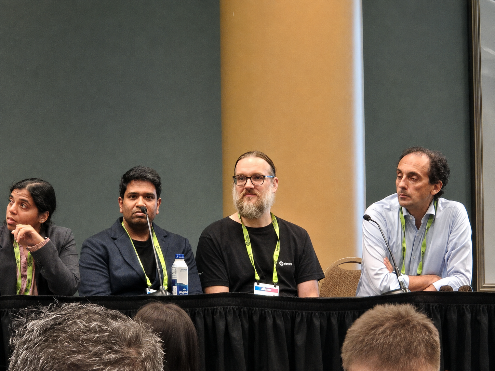
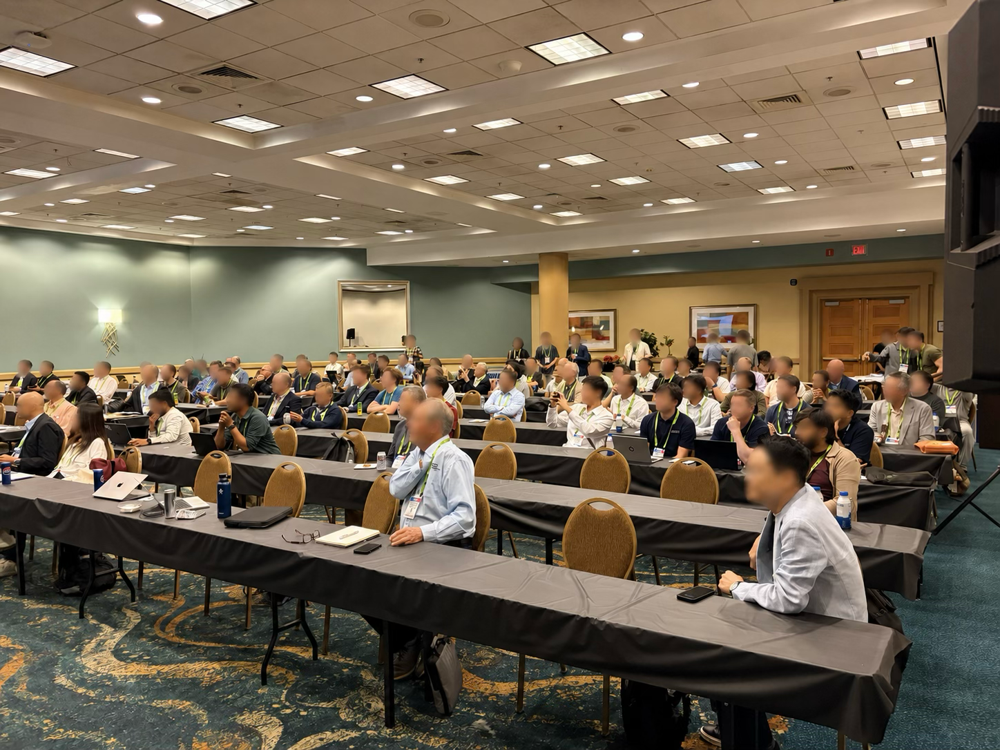
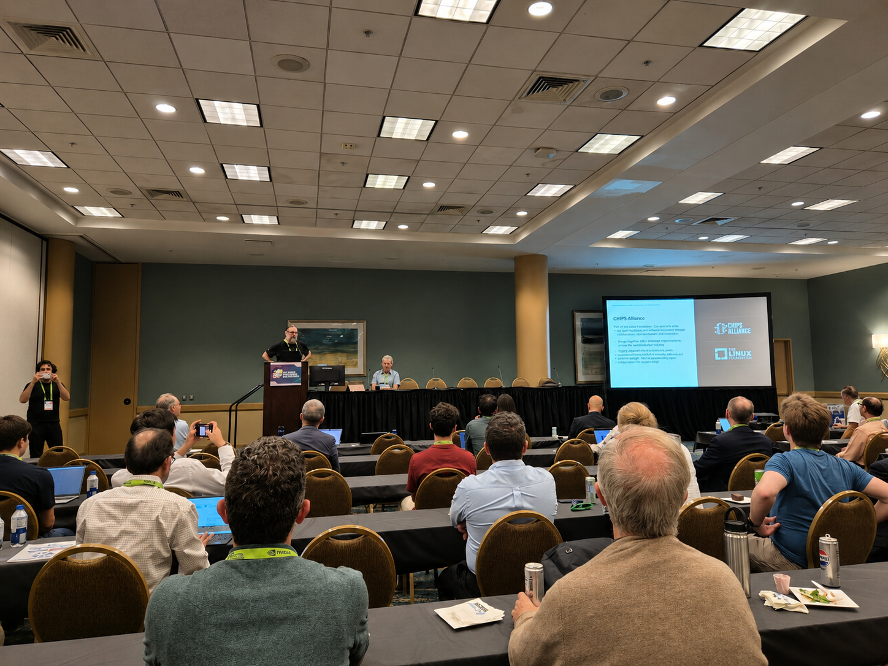

**By: Dr. Yiting Liu, UC San Diego**       

The energy at [DAC 2026](https://63dac.conference-program.com/) in Long Beach was palpable during the seventh annual **Open-Source EDA Birds-of-a-Feather (BoF)** session. This fast-paced Tuesday evening forum gathered academic researchers, industry practitioners, and open-source developers to discuss the transformative intersection of AI, open-source hardware, and open-source EDA. As the lines between traditional EDA and agentic AI blur, the session proved that the open-source EDA community is more active and essential than ever.       

    

#### By the Numbers: A Standing-Room-Only Success    

This year’s turnout once again exceeded expectations, highlighting the growing momentum behind the open-source EDA ecosystem, with well over 120 attendees participating in the evening's discussions.    

#### Session Highlights: From AI Agents to Workforce Development    
The evening was packed with rapid-fire presentations and state-of-the-ecosystem updates. The [agenda](https://open-source-eda-birds-of-a-feather.github.io/) covered critical themes shaping the future of design automation, starting with a look at the open-source ecosystem and infrastructure. The OpenROAD Initiative gave an update on its organization and governance structure. The session also included an update from CHIPS Alliance, highlighting ongoing collaboration across open-source hardware and EDA projects.  Other presentations announced 2nm nanosheet research PDK availability, and 3D ODB updates.     

Sessions on AI-assisted EDA and physical design workflows shared current trends and practical insights into near term deployment opportunities and challenges. Speakers explored open benchmarks for LLM-assisted RTL, discussed benchmarking standards for open-source infrastructure, and showcased innovative ways to leverage AI for real DRC sign-off.    

A focal point for the evening was the **Workforce Development and Training** session, with talks on reshaping  university curricula with open-source EDA and PDKs, and on building open platforms for research, education and collaboration. Then, a vibrant panel on **Rethinking Skill Sets in the Age of AI** brought together eight experts from academia and industry. The discussion explored a critical question: as AI increasingly automates the "how" of building, how must academia shift toward training the next generation of engineers to master the "what" of high-level design? This thought-provoking discussion generated a highly engaged audience response with far more questions than time allowed!    

    

#### Huge Thanks to Our Contributors and Sponsors    

An event like this truly "takes a village." Huge thanks go out to the incredible presenters, panelists, and attendees for bringing so many updates and insights to the community. A special shoutout goes to **CHIPS Alliance, Precision Innovations, Inc.** and **UC San Diego** for providing financial and logistical support.    

Heartfelt thanks go to my co-organizer, **Oleg Levitsky**  (Precision Innovations, Inc.), whose hard work behind the scenes drove the session's excellent content, smooth time management, and overwhelmingly positive feedback. Additional thanks to **Andrew Kahng** (UC San Diego) for setting the stage with welcoming remarks and his ongoing leadership in this space.    

#### Looking Ahead    

The DAC 2026 Open-Source EDA BoF reinforced a clear message: whether it's robust PDK development, benchmarking standards, or leveraging LLMs for chip design flows, the open-source ecosystem is broadly shaping the next era of semiconductor innovation.     

Thank you to everyone who joined us in Long Beach! We can't wait to see what the community builds together before we meet again.    

    
