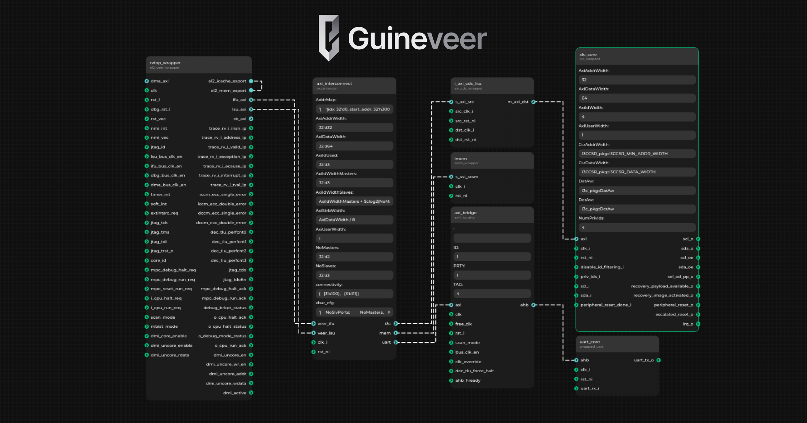
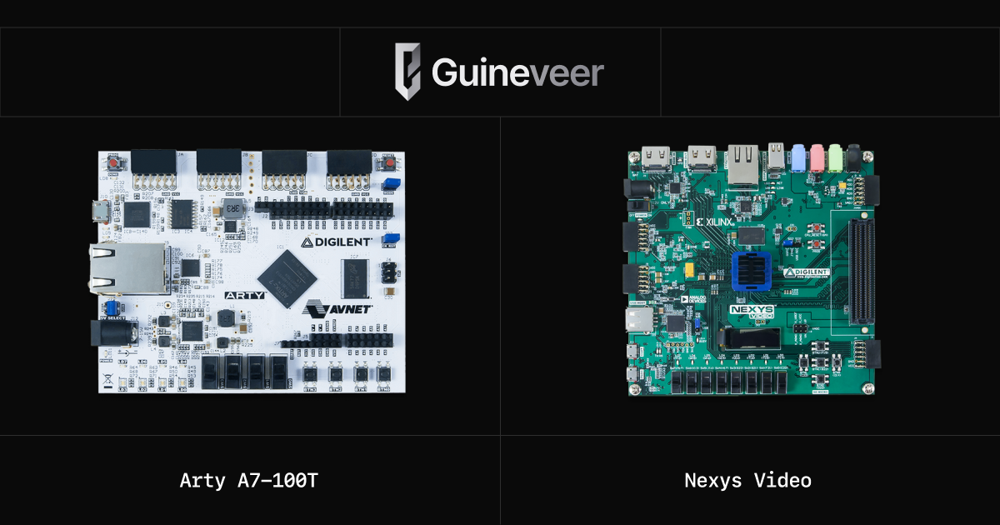
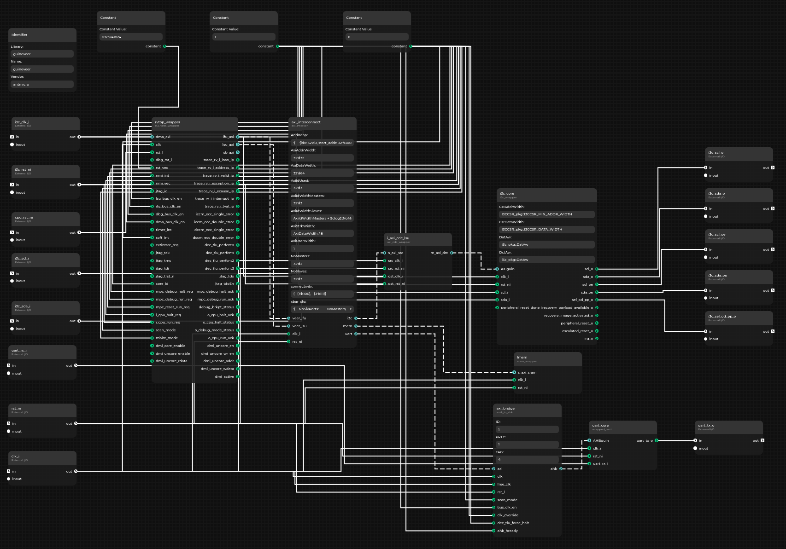

Designing a System-on-Chip (SoC) typically involves a lot of reuse, as CPU cores and I/O peripherals are rarely built completely from scratch, but rather gradually enhanced and integrated into different configurations.

[Some time ago](https://www.chipsalliance.org/news/topwrap/), CHIPS Alliance member Antmicro introduced a versatile, user-friendly framework for digital design aggregation called [Topwrap](https://github.com/antmicro/topwrap), which lets you assemble ASIC designs from building blocks. Topwrap's capabilities have since been significantly improved, including a number of features supporting module-based flows and managing interconnects, making the tool an interesting option

In this article, we take a look at how you can use Topwrap together with [Guineveer](https://github.com/chipsalliance/guineveer), a RISC-V reference SoC that Antmicro contributed to CHIPS, based on the [VeeR EL2 core](https://github.com/chipsalliance/Cores-VeeR-EL2). WIth Topwrap and the help of integrated open source tools, such as [Renode](https://renode.io/) and [Verilator](https://www.veripool.org/verilator/), you can easily experiment with Guineveer’s design to generate, expand, and test your own custom SoC.



### **Guineveer: a RISC-V reference SoC design**

[Guineveer](https://github.com/chipsalliance/guineveer) is a simple and extensible reference design based on the RISC-V [VeeR EL2](https://github.com/chipsalliance/Cores-VeeR-EL2) core, meant to serve as a baseline for creating custom SoCs.

VeeR EL2 is a tiny, 32-bit variant of the [CHIPS-hosted VeeR family of open source, production-grade RISC-V cores](https://www.chipsalliance.org/news/open-source-rtl-ci-testing-and-verification-for-caliptra-veer/). It's a low-power, in-order, and highly configurable core with optional features, such as closely coupled memories, CPU instruction cache, branch prediction, [physical memory protection](https://antmicro.com/blog/2024/01/pmp-for-veer-el-risc-v-core/), [user mode](https://antmicro.com/blog/2024/09/user-mode-in-veer-el2-core-for-caliptra-2-0/), and Dual-Core Lockstep.

On top of VeeR itself, Guineveer also integrates several open source cores developed within CHIPS Alliance, [lowRISC](https://lowrisc.org/) (the OpenTitan steward organization), and ETH Zurich's PULP project, in a sample SoC design that can be modified and expanded with new peripherals. It currently consists of the following components:

* [VeeR EL2](http://github.com/chipsalliance/Cores-VeeR-EL2)  
* [OpenTitan UART](https://github.com/lowRISC/opentitan/tree/master/hw/ip/uart)  
* [AXI to AHB bridge](https://github.com/chipsalliance/Cores-VeeR-EL2/blob/main/design/lib/axi4_to_ahb.sv) (from the VeeR EL2 repository)  
* [I3C core](https://github.com/chipsalliance/i3c-core)
* Several AXI building blocks from PULP:  
  * [AXI\_to\_mem](https://github.com/pulp-platform/axi/blob/master/src/axi_to_mem.sv) for SRAM  
  * [AXI Crossbar Interconnect](https://github.com/pulp-platform/axi/blob/master/scripts/axi_intercon_gen.py)  
  * [AXI\_CDC](https://github.com/pulp-platform/axi/blob/master/src/axi_cdc.sv)


 

Guineveer's design is available in Topwrap’s YAML format, which describes used modules, their parameters, and how they are connected to each other. Topwrap enables you to modify the design rapidly by editing the parameters of existing components, or by easily adding and connecting new ones. You can, of course, also modify the SoC design as usual, by editing the YAML description file.

The Guineveer SoC architecture uses the following YAML description:

```yaml
design:
  name: guineveer
  parameters:
    # ...
  interfaces:
    axi_bridge:
      axi: [axi_interconnect, uart]
    axi_interconnect:
      veer_ifu: [rvtop_wrapper, ifu_axi]
      veer_lsu: [rvtop_wrapper, lsu_axi]
    uart_core:
      ahb: [axi_bridge, ahb]
    lmem:
      s_axi_sram: [axi_interconnect, mem]
    rvtop_wrapper:
      el2_mem_export: [rvtop_wrapper, el2_icache_export]
  ports:
    i_axi_cdc_lsu:
      src_clk_i: clk_i
      src_rst_ni: rst_ni
   # ...
```

For FPGA emulation, Guineveer currently targets mid-range [Artix-7 FPGAs](https://www.amd.com/en/products/adaptive-socs-and-fpgas/fpga/artix-7.html) from AMD, including the [Nexys Video](https://digilent.com/reference/programmable-logic/nexys-video/start?srsltid=AfmBOopkMsPFv7vDs2w21aUxAicKlChpPkxVw0eCnvcxhuqg8OUUqe3B) and [Arty A7-100T](https://digilent.com/shop/arty-a7-100t-artix-7-fpga-development-board/?srsltid=AfmBOop5ENKIHmLSnh66Q53sqJJiGonCWFAhdgdRk0xepWQvSPgaHixE) boards. In its current form, the Guineveer FPGA design takes up about 40% of the available logic cells on Arty A7-100T.




### **Testing the new SoC design** 

All the components, taken individually, have their own test suites. However, in a broader scope, a new SoC design requires testing in its entirety.

Guineveer implements a regression test suite, together with unit tests for individual IP cores and Integration Tests (System-Level Tests) that verify the complete SoC functionality (e.g., booting an operating system, running benchmark applications). The framework supports running tests in both Renode and Verilator and on actual FPGA hardware, to validate real-world behavior.

Additionally, you can conveniently plan tests for your own SoC designs with the open source [Testplanner](https://antmicro.com/blog/2025/06/automating-design-and-dv-tracking-with-testplanner) which is being continuously extended to support more advanced DV tracking flows.

**Renode tests and co-simulation**

Guineveer includes platform description logic for simulations in [Renode](https://renode.io/), which facilitates the testing of software written for the platform you are designing. Below, you can find a simple implementation of a print command, based on the OpenTitan UART, which you can use to perform a baseline test.

````
memory0: Memory.MappedMemory @ sysbus 0x80000000
    size: 0x10000000

cpu0: CPU.VeeR_EL2 @ sysbus
    hartId: 0

memory1: Memory.MappedMemory @ sysbus 0x90000000
    size: 0x10000000

uart: UART.OpenTitan_UART @ sysbus 0x30000000

i3c: CoSimulated.CoSimulatedPeripheral @ sysbus \
  <0x30001000, +0x1000>
    limitBuffer: 50000
    timeout: 500000
    address: "127.0.0.1"
    cosimToRenodeSignalRange: <0, +5>
````

Using Renode allows you to quickly develop new tests for your platform, as the functional simulation executes significantly faster than RTL-based simulation.

There is also an option to run a Renode co-simulation setup for Guineveer, where a specific Renode model of a peripheral can be replaced with a from-RTL instance of the actual core simulated via Verilator, for testing of enhancements in specific IP blocks.



**Example test suites**

Guineveer includes two extendible test suites to verify your SoC design. There is a standard SystemVerilog testbench and a Cocotb testbench written in Python. These testbenches capture logs printed over the (emulated) UART, manage timeouts, and use a mechanism for the CPU to notify the testbench that a test is over. Such a flow enables you to receive a test log in a regular console, in the same way the log would be produced by the program running on the real hardware, for example:

```bash
VerilatorTB: Start of sim

mem_mailbox = 80f80000
[UART MONITOR]: Hello UART

Finished : minstret = 7119, mcycle = 31087
See "exec.log" for execution trace with register updates..

VerilatorTB: End of sim
```

### **Extending Guineveer to include an I3C core**

Basing on Topwrap makes it very easy to extend Guineveer with additional I/O cores for interfaces such as I3C (which is now included by default). The CHIPS Alliance [I3C core](https://github.com/chipsalliance/i3c-core) included in Guineveer implements the I3C target functionality of the I3C bus protocol (laid out by the MIPI Alliance), and is actively developed by Antmicro and partners within the CHIPS Alliance. The core supports [Open Compute Project (OCP)](https://www.opencompute.org/)'s [recovery flow](https://www.opencompute.org/documents/ocp-recovery-document-1p0-final-1-pdf).

Intended to be an upgrade over I2C, I3C offers many improvements while maintaining some backward compatibility with existing I2C targets. Examples of I3C use cases include DDR5 memory modules and PCI Express device management. It's also used in [CHIPS' Caliptra Root-of-Trust project](https://github.com/chipsalliance/Caliptra/blob/main/README.md).

Including I3C in the Guineveer SoC reference design required instantiating the core, specifying the interfaces, and making connections that include `clk` and `rst`. In a traditional development flow, the I3C core, in combination with the AXI interface, requires a lot of interconnects to be designed manually, which can be quite challenging and time-consuming.

The improved Topwrap capabilities (which will be described in a separate blog article) automates this process by parsing the SystemVerilog source files to recognize the I3C core, with its signals and interfaces, allowing to reference it conveniently in the design description file, without having to describe the core manually. For example, multiple signals from the AXI interface are substituted with a single connection in Topwrap. As mentioned before, Topwrap also prevents errors, invalidating any erroneous connections it detects.

Besides editing the YAML description manually or via the API-based CLI, you can also simply load the Guineveer YAML file into the Topwrap GUI interfaces, then use the blocks and parameters available in the GUI to modify the SoC to your purpose.



Here is how Topwrap modifies the design description (YAML file) to include the I3C core on the AXI interface:


```diff
design:
  name: guineveer
  parameters:
    # ...
  interfaces:
+    i_axi_cdc_lsu:
+      s_axi_src: [axi_interconnect, i3c]
    axi_bridge:
      axi: [axi_interconnect, uart]
    axi_interconnect:
      veer_ifu: [rvtop_wrapper, ifu_axi]
      veer_lsu: [rvtop_wrapper, lsu_axi]
+    i3c_core:
+      axi: [i_axi_cdc_lsu, m_axi_dst]
    uart_core:
      ahb: [axi_bridge, ahb]
    lmem:
      s_axi_sram: [axi_interconnect, mem]
    rvtop_wrapper:
      el2_mem_export: [rvtop_wrapper, el2_icache_export]
  ports:
+    i_axi_cdc_lsu:
+      dst_clk_i: i3c_clk_i
+      dst_rst_ni: i3c_rst_ni
      src_clk_i: clk_i
      src_rst_ni: rst_ni
  # ...
```

As mentioned, you can produce the same result by modifying the YAML files manually or via the console/programmatic API, but the GUI is a convenient way to get a graphical overview of all the connections.

### **Adding I3C tests: OCP recovery boot flow**

OCP provides a standard describing the recovery process for a failed or compromised device. In this standard, I3C can be used as a bus to implement the recovery flow.

One of the supported boot flows is [streaming boot](https://www.mdpi.com/2674-0729/4/1/6), during which a recovery agent sends a firmware image to be booted to the device. The tests for the recovery flow are run in a simulation, where Cocotb is used again, similar to other tests involving I3C communication. In this scenario, an implementation of the recovery interface protocol is provided by the  [Cocotbext-i3c](https://github.com/antmicro/cocotbext-i3c) extension, and the test implements a recovery agent.

The Cocotb recovery agent test waits for the I3C core to enter recovery mode, then streams the image through the I3C core to the bootloader running on the main CPU, the Veer EL2 core, to complete the recovery. The Cocotb test then checks UART for the message that confirms that the new image works and recovery has been completed.

Testing the I3C streaming boot on an FPGA requires additional hardware to act as the recovery agent. To that end, we have used an [NXP i.MX RT685 evaluation board](https://www.nxp.com/part/MIMXRT685-EVK), which implements the recovery agent that uses the I3C core's recovery boot flow by running Antmicro's [custom Zephyr application](https://github.com/antmicro/guineveer-zephyr-app).



### **Enabling automated design of custom RISC-V SoCs**

Open source design aggregation tools such as the [Topwrap](https://github.com/antmicro/topwrap/tree/main) framework help facilitate the reuse of well-defined and tested building blocks in ASIC designs. When efficiently organized, design components can be combined and managed to accelerate workflows and further lower the entry barrier in chip design.

The readily available example of an open source digital design flow described by CHIPS above, utilizing Topwrap and the Guineveer reference design, provides the industry and open chip design community with an easy entry point to building custom, RISC-V-based SoC, including a complex bus system and multiple interconnected IP blocks.
