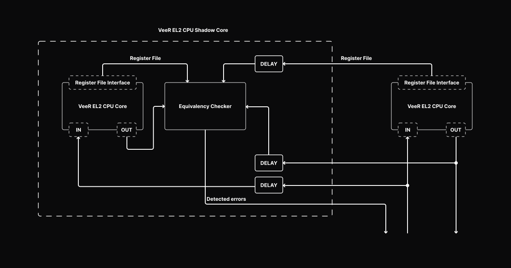

Safety-critical applications, especially those used in the fields of aerospace, automotive and industrial control systems, require high-reliability computing and fault-tolerant operation. Techniques such as Triple Modular Redundancy (TMR) and Dual Modular Redundancy (DMR, e.g. Dual-core Lockstep (DCLS)) provide an extra layer of protection against errors by replicating critical components of a system. TMR involves triplicating key system elements and using majority voting to determine the correct output, thereby mitigating the impact of faults. DMR, a more resource-efficient approach, relies on duplicating components and comparing their outputs to detect inconsistencies.

Another DMR use case is protection against side channel attacks in security contexts like Root of Trust macros, where DMR can help detect and prevent error injection when the attacker gains physical access to the chip.

DMR is particularly advantageous in applications where power, cost, and space constraints make TMR less practical, but where fault detection and mitigation still remain critical. These fault-tolerant architectures are further augmented by rigorous software validation, creating a comprehensive safety framework for systems that cannot afford failure.

This article describes the implementation of a DCLS functionality in the [VeeR EL2](https://github.com/chipsalliance/Cores-VeeR-EL2), a 32-bit core variant from the VeeR family of RISC-V cores hosted by [CHIPS Alliance](https://www.chipsalliance.org). Explained by CHIPS Alliance member Antmicro, we will discuss how the DCLS module detects errors, show how to configure DCLS in the VeeR EL2 core, and briefly describe the verification process.

### DCLS in VeeR EL2

Dual-core Lockstep was [added as an optional feature of VeeR EL2](https://github.com/chipsalliance/Cores-VeeR-EL2/pull/354), disabled by default. When enabled, another copy of the VeeR EL2 CPU core will be instantiated in the design, referred to as the Shadow Core. The Shadow Core is delayed by a constant, configurable `DELAY` number of clock cycles, in respect to the Main Core. If an attacker wants to somehow alter the behavior of the Main Core, they would also need to know the delay of the copy (the Shadow Core), and alter it in the exact same way, after this specific delay. This complicates the attack greatly, and thus increases the security of the system.



DCLS includes multibit encoding, for its boolean status and control signals, which can be configured, allowing the user to set the width of the encoding (the length of the value that is used for remapping true/false states), as well as to select the specific value in that encoding associated with "true", and another value associated with "false". By encoding the boolean values onto multiple bits, we make it significantly less probable to receive a valid value by bit-flipping (caused by environmental factors or malicious actors), as there are multiple possible values out of which only 2 are valid. Any undefined value derived by the Shadow Core's status and control signals is considered a corruption.

If at any moment the original core produces different outputs (considering the delay) than the Shadow Core, a corruption is detected and reported. Since the Shadow Core module must replicate the behavior of the Main Core without any differences, it contains the same input and output ports; however, the input data for the Main Core is delayed before being routed to the Shadow Core, and the output data from the Shadow Core is compared with the delayed output data from the Main Core.

The implementation of DCLS in VeeR EL2 can be useful for various applications, like rad-hardening or side-channel mitigation scenarios as in the case of CHICPS Alliance's [Caliptra](https://github.com/chipsalliance/Caliptra/tree/main) Root of Trust project.

### Monitored registers

Even though every discrepancy between the register files of the Main Core and Shadow Core will eventually lead to differences between IOs of these modules, it might take some time for the mismatch to manifest. The Main and the Shadow cores can have their register file access exposed by setting a proper VeeR EL2 configuration flag.

To determine whether a discrepancy has occurred immediately, a reasonable subset of the VeeR EL2 registers from the register files from both cores will be compared. The DCCM and ICCM memories are not duplicated, and only the main VeeR EL2 CPU core has access to them. The Shadow Core is only supplied with the delayed inputs to the Main Core, including the relevant DCCM and ICCM data, without any ability to read from, or write to, those memories by itself. Both cores operate on separate register files. The Shadow Core’s register file can be monitored via the exposed Register File Interface.

The Dual-core Lockstep module will report a detected error by asserting a single bit or multibit output signal, based on the core configuration. The error can be artificially injected by using Shadow Core Control capabilities. The corruption error will be reported when all of the following requirements are met:

1. Input and Output signals of both Main Core and Shadow Core differ, an error injection feature is enabled, or DCLS control signals contain invalid encoding,
2. The Shadow Core is not in reset state,
3. The Shadow Core is not disabled,
4. Error detection is not being actively disabled through control signals.

Any detected error will relegate the problem to the external controller, and wait for the system to reset.

### Configuring DCLS

DCLS can be enabled in the VeeR EL2 core with the following config command:

```
veer.config -set lockstep_enable=1 -set lockstep_regfile_enable=1
```

The multibit feature can be configured with the following options:

```
-set mubi_width=4 -set mubi_true=0x6 -set mubi_false=0x9
```

Where:

* `-set mubi_width=4` means that we use 4-bit-wide signals.
* `-set mubi_true=0x6` sets the value `4'b0110` as True.
* `-set mubi_false=0x9` sets the value `4'b1001` as False.

### Verification

The DCLS block has been verified with tests from the [DCLS module validation plan](https://chipsalliance.github.io/Cores-VeeR-EL2/html/main/docs_rendered/html/dual-core-lock-step.html#validation-plan) which includes unit as well as software tests. In the [software tests](https://github.com/chipsalliance/Cores-VeeR-EL2/tree/83964-DCLS-covergroups/testbench/tests/dcls), the DCLS module is verified with the use of the VeeR EL2 core. The software running on the Main Core injects errors to the DCLS core by driving its error injection signal. For unit tests, the [cocotb](https://www.cocotb.org) framework along with the [PyUVM](https://github.com/pyuvm/pyuvm) library is used. PyUVM implements UVM (Universal Verification Methodology) in Python, making it both reliable and easy to use.

All tests for the DCLS module are executed within the [Cores-VeeR-EL2 Continuous Integration regression flow](https://github.com/chipsalliance/Cores-VeeR-EL2/blob/main/.github/workflows/test-regression-dcls.yml) covering AXI and AHB configurations of VeeR, as well as U-mode tests.

### High-reliability computing for safety-critical systems

By boosting error detection, DCLS can greatly enhance the security and reliability of RISC-V-based systems, making it extremely difficult to interfere with their operation. If you’re looking at using a customized RISC-V core for your next safety-critical application, CHIPS Alliance’s VeeR EL2 with its DCLS implementation is definitely worth considering.

Follow the [Caliptra](https://github.com/chipsalliance/caliptra) and [VeeR EL2](https://github.com/chipsalliance/Cores-VeeR-EL2) projects on GitHub and subscribe to [announce@chipsalliance.org](mailto:announce@chipsalliance.org) to stay on top of recent developments.
