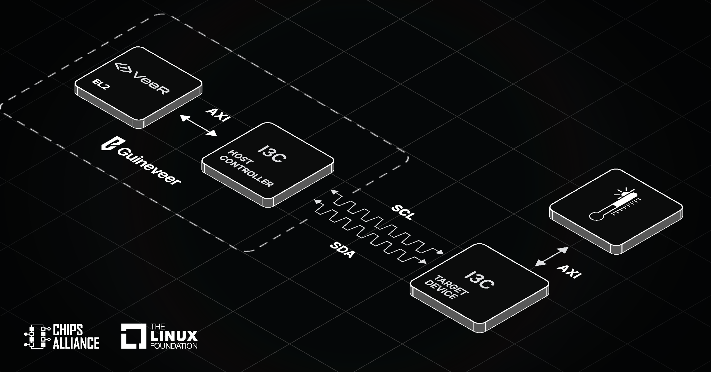
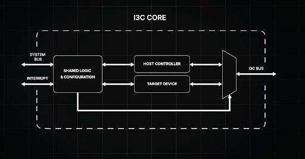

With a growing variety and number of peripherals, such as power management ICs, various sensors, and other communication systems, modern embedded devices need to face the challenge of increasingly limited space. Traditionally, the I2C interface is commonly implemented, as I2C, in perfect conditions, communicates with the use of only two wires (interrupts do require additional wire per peripheral). However, with the limitation of size and more peripherals occupying smaller footprint PCBs, I2C may struggle in terms of energy efficiency, bandwidth and device management.    

To address these constraints, the [MIPI I3C specification](https://www.mipi.org/specifications/i3c-sensor-specification) was developed. The I3C protocol is the backwards-compatible successor to I2C. It incorporates its key capabilities, maintains the usage of only two wires, yet in many cases provides significant improvements over I2C. Based on the MIPI I3C, [CHIPS Alliance](https://www.chipsalliance.org), part of Linux Foundation, introduced an [open source I3C Core](https://github.com/chipsalliance/i3c-core). The Core is already used in the likewise CHIPS-hosted [Caliptra](https://github.com/chipsalliance/caliptra) Root-of-Trust project and the SoC reference design [Guineveer](https://antmicro.com/blog/2025/12/custom-risc-v-soc-design-topwrap-guineveer) based on the [VeeR EL2 RISC-V core](https://github.com/chipsalliance/Cores-VeeR-EL2).    

Initially, the I3C Core only supported Target mode. To further improve its functionality, CHIPS Alliance member Antmicro has now implemented a set of features for Host Controller support. This article describes the benefits of using the I3C protocol as well as the addition of Host Controller support to the I3C Core.   

    

#### I3C Protocol features and its improvements over I2C    

The MIPI I3C (Improved Inter-Integrated Circuit) specification was developed as a successor to the widely popular I2C communication interface. Typically, it is used in wearable devices, tablets, phones, IoT devices, as well as server-applications. It incorporates some of the key aspects of I2C, including the usage of a two-wire interface with a clock (SCL) and data (SDA) lines. However, it also provides significant advancements over the legacy I2C design. The main features of I3C we will be describing are:    

- Improved bandwidth and clock (CLK) speed
- Dynamic Addressing
- Hot-Join
- In-Band-Interrupts (IBI)     

##### Bandwidth and CLK speed     

While I2C allows for a maximum CLK speed of ~1 MHz and a maximum bandwidth of ~0.9 Mbit/s (in Fast-mode Plus), the I3C communication bus improves both those parameters even further. [According to the specification](https://www.mipi.org/specifications/i3c-sensor-specification), I3C can operate at a speed of 12.5 MHz and a bandwidth of ~11 Mbit/s for Single Data Rate (SDR) and ~25 Mbit/s for High Data Rate (HDR), with SDR used for Legacy I2C devices and HDR used for I3C devices. The significantly higher bandwidth is achieved using much less power than the legacy I2C thanks to its ability to switch between open-drain and push-pull operations.

##### Dynamic addressing    

I2C uses a static interface, which means that every peripheral has a hardwired address on its PCB, with no way to change it without modifying the hardware itself. Because of that, devices using I2C could encounter an address conflict if using two identical Target devices (like two of the exact same sensor). The I3C protocol solves this issue by automatically assigning a unique Dynamic Address to each Target device during initialization, and allows the user to change the address at any point (even during deployment on the field), completely eliminating the problem of conflict.      

Dynamic addressing is very useful for arbitration; depending on the address of a Target device, the user can assign a priority to certain addresses. In open-drain arbitration, the device with the lowest address receives the highest priority, which means the order of priority can be flexibly rearranged by the user by changing the addresses of the peripheral devices.     

##### Hot-Join    

In Legacy I2C, Targets were all simultaneously powered at boot, with no ability to connect an additional device once the bus has been initialized or power off an already connected peripheral device. I3C's [Hot-Join](https://www.mipi.org/hubfs/I3C-Resources/MIPI-Alliance-I3C-v1-2-Hot-Join-App-Note-public-edition.pdf) feature allows for connecting new devices in the middle of operation - upon connecting the new device, it receives a Dynamic Address from the Controller and is ready to be operational nearly immediately.     

This enables the option to power down a Target device temporarily during the operation of the bus, and then power it back on once it is required to communicate with the Controller. This method of operating saves a significant amount of power, since peripheral devices are powered down instead of draining power while idle.     

##### In-Band-Interrupts    

In order to raise an interrupt within the I2C communication bus, additional interrupt lines are required for a Target to communicate with the Controller, with each separate Target needing its own line - meaning that a device with many peripherals will require many additional lines on an already size-limited PCB. To save space, the I3C specification uses In-Band-Interrupts (IBI); this allows all the connected devices to raise an interrupt request through SDA and SCL lines instead of requiring their own dedicated interrupt lines.    

Furthermore, each device is assigned a priority level based on its Dynamic Address, with lower numerical values having higher priority. If multiple IBIs are raised at the same time, the Controller will process the requests in order of the priority of the connected devices.    

##### The open source I3C Core now with Host Controller support   

As mentioned at the beginning of this article, CHIPS Alliance's [open source I3C Core](https://github.com/chipsalliance/i3c-core) only included Target Device capabilities upon release. Antmicro has now expanded it significantly, equipping it with Host Controller support. A Target device can follow orders from the Controller and request data; the Controller, on the other hand, has a broader range of capabilities: starting the communication process with Targets, assigning Dynamic Addresses, sending commands, reading and writing data, and managing bus ownership.

    

The I3C Controller is designed for compliance with I3C HCI v.1.2 and I3C Basic v.1.1.1; additionally, it is backwards compatible with I2C, allowing it to function with Legacy I2C systems. It includes error handling, and support for Common Command Codes (CCC), which are required for bus management, configuration and initialization.    

The Host Controller allows for configuration of timing registers through Control and Status Registers (CSRs). The timing registers enable configuring the Core to conform to specified bus timings in a wide range of system clock frequencies. The Core's Controller features also include previously mentioned IBI, dynamic switching between push-pull and open drain mode, and Dynamic Address Assignment using ENTDAA CCC.     

A full list of Host Controller features implemented into the Core can be found in the [documentation](https://chipsalliance.github.io/i3c-core/controller_overview.html).    

To ensure the reliability and protocol compliance of the I3C Host Controller, Antmicro implemented a verification methodology spanning virtual simulation and physical hardware, which is described in the next section.    

##### Verification of the Host Controller support    

The simulation environment is built around [cocotb](https://www.cocotb.org/), utilizing a custom [cocotbext-i3c](https://github.com/antmicro/cocotbext-i3c) Verification IP (VIP) that Antmicro developed and published to support both Host Controller and Target modes. Guided by a dedicated [testplan](https://chipsalliance.github.io/i3c-core/sim-results/index.html), Antmicro authored a comprehensive verification suite to run the core through a wide variety of traffic scenarios, including standard data transfers, Dynamic Address Assignment (DAA), In-Band Interrupts (IBI), and edge-case error injections.    

The simulation was run using Verilator, taking advantage of the recently developed [4-state support](https://antmicro.com/blog/2026/04/initial-support-for-four-state-logic-in-verilator).    

Finally, to validate the controller outside of the virtual proving ground, Antmicro took the verified RTL and ran a full FPGA implementation on the AMD ZynqMP ZCU106 evaluation board. Connecting the I3C Host Controller to their [PMOD I3C Sensor Board](https://designer.antmicro.com/library/devices/zcu106_i3c_controller_setup) allowed to successfully demonstrate full 12.5MHz communication speeds against off-the-shelf, 3rd-party silicon in the real world.    

##### Next steps in development     

The addition of Host Controller Support to the I3C Core establishes a robust foundation for I3C communication in the open source IP portfolio, paving the way to enabling more capabilities.     

Looking ahead, the development roadmap could include several advanced protocol features, such as implementing aforementioned Hot-Join support. Furthermore, introducing High Data Rate (HDR) modes to support even higher bandwidth than with the baseline Standard Data Rate (SDR) is a logical next step, as well as Multiple Controller support to allow dynamic role hand-offs and multi-manager bus topologies.     

Building on the current simulation and board-level verification, the next major step in system integration is deploying the complete [Guineveer](https://github.com/chipsalliance/guineveer) reference RISC-V SoC equipped with the new I3C Host Controller on an FPGA. Potentially, such a setup may serve as a comprehensive, open source reference platform for I3C.      

Of course, hardware is only as useful as the software that drives it. To support low-power embedded devices, Antmicro is planning to develop an I3C driver for [Zephyr RTOS](https://www.zephyrproject.org/). And since the Host Controller implements the standard Host Controller Interface (HCI), full Linux I3C driver support is also possible. This will eventually enable seamless integration directly with the upstream Linux kernel subsystem.     

##### Implement the I3C Core into your custom system    

The addition of the Host Controller support to the open source I3C Core is an interesting improvement, allowing it to now direct networks of peripheral devices. The I3C protocol significantly decreases power usage, eliminates the need for additional wiring required using Legacy I2C, and allows for dynamically changing addresses of Targets.     

##### Get involved     

Join [VeeR Technical Steering Committee meetings](https://github.com/chipsalliance/VeeR), held biweekly on Fridays at 5:00 PM CET (8:00 AM PST).     

Subscribe to announce@chipsalliance.org to stay up to date on recent CHIPS Alliance developments.     

