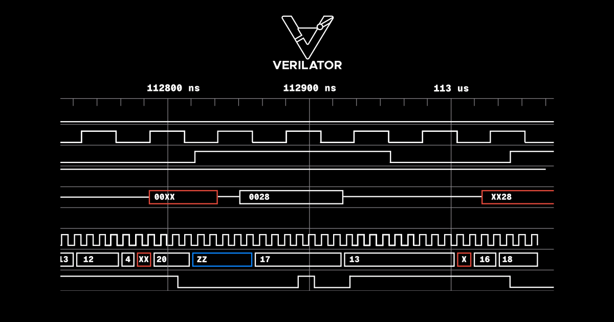

[Verilator](https://github.com/verilator/verilator) is an extremely popular open source simulator, used in a number of ASIC and FPGA workflows where its default two-state operation model (i.e. only representing the logic values of `1` and `0`) is enough. While two-state simulation is much faster and memory-efficient, and sufficient for many applications such as functional testing and debugging, when dealing with initialization bugs or high-impedance states, four-state simulation (which supports logic values of `1`, `0`, `x` and `z`) becomes necessary.   

CHIPS Alliance member [Antmicro](https://antmicro.com/) has been a major contributor to Verilator for a while now, gradually introducing important features such as [UVM support](https://antmicro.com/blog/2025/10/support-for-upstream-uvm-2017-in-verilator) and [constrained randomization](https://antmicro.com/blog/2024/08/constrained-randomization-in-verilator-implementation-details), and collaborating with other contributors to expand the open source ASIC development ecosystem, with significant efforts converging within the recently restructured [SV Tools Project](https://github.com/chipsalliance/sv-tools) of CHIPS Alliance. Recently, Antmicro has been working on implementing four-state logic in Verilator. Due to its complexity, the project will require an ongoing effort spread across multiple PRs and months.   

However, an important initial milestone has already been reached, as visible in the [initial PR](https://github.com/verilator/verilator/pull/7193) that will serve as a starting point for further development. This article explains the rationale behind adding four-state logic in Verilator and describes the current status of the implementation.    

   

#### More accurate simulation and debugging with four-state logic   

In SystemVerilog, many data types can have four-state values. Four-state logic allows for more accurate hardware simulation as it supports not only `0` and `1` states, but also `z` (high impedance) and `x` (unknown value). High impedance usually means an unconnected or floating wire. An unknown value could mean either `1` or `0`, but it can also indicate potential design flaws, e.g. bus contention.

As ambiguous values (`x` and in some cases `z`) tend to spread throughout the simulation, four-state logic makes it easier to spot them during debugging.

For example, let's take a look at the following SystemVerilog snippet:

```
logic val1;
logic val2 = val1 & 1;
```

Without four-state logic, during simulation `val1` may take the value of `0` or `1` (depending on the configuration), since it is uninitialized. `val2` will also take the value of `0` or `1`, which at first glance may seem correct. But with four-state logic, `val1` will be equal to `x` and as a result, `val2` will be equal to `x` as well, which makes it obvious that this is not a valid value.    

Four-state logic also allows detecting wires connected to high and low states at the same time:    

```
wire val;
assign val = 1;
assign val = 0;
// val is x because of ambiguity
```

#### Implementing four-state logic in Verilator    

In order to avoid the need to reimplement a vast number of Verilator's existing optimizations that are applied early in the verilation process, four-state variables are split into two two-state variables which are already supported and operations on which are greatly optimized. In practice, this means that for the most part, Verilator works independently of the four-state logic implementation, making maintenance easier and accelerating further development.    

In the proposed implementation, four-state logic in Verilator is available under an experimental `--fourstate` flag. By default, four-state logic is disabled. For the sake of forward compatibility, a `--no-fourstate` flag was also added to allow for disabling four-state logic support in favor of two-state logic.    

```
logic val1 = 1;  // will turn into:   bit val1_value = 1;
                                      bit val1_xz = 0;
logic val2 = 'z;  // will turn into:  bit val2_value = 0;
                                      bit val2_xz = 1;
logic val3 = val1 & val2;  // into:   bit val3_value = (val1_value | val1_xz)
                                                     & (val2_value | val2_xz)
                                      bit val3_xz = (val1_value & val2_xz)
                                                  | (val2_value & val1_xz)
                                                  | (val1_xz & val2_xz)
// Result: val3_value == 1
//         val3_xz == 1
//         val3 == 'x
```

For more details about the implementation, refer to the [GitHub Pull Request](https://github.com/verilator/verilator/pull/7193).    

#### Towards full four-state logic support in Verilator    

The developments described in this article constitute just the first step on the way towards full four-state logic support in Verilator. Effort is currently underway on more features, such as four-state support in arrays and queues, and scheduler adjustments, which will be described in future articles.    

For those who are interested in learning more, the presentation slides and recording of AntMicro's talk given at FOSSi Foundation's [Latch-Up conference](https://fossi-foundation.org/latch-up/2026#the-next-big-step-for-verilator-towards-four-state-logic-and-new-developments-in-uvm-compatibility) last month in Waterloo, Canada, are [available here](https://fossi-foundation.org/latch-up/2026#the-next-big-step-for-verilator-towards-four-state-logic-and-new-developments-in-uvm-compatibility). You can also revisit our blog describing the goals and recent developments of the restructured [CHIPS Alliance SV Tools Project](https://antmicro.com/blog/2026/03/chips-alliance-launches-the-sv-tools-project) (sv-tools@chipsalliance.org), and subscribe to announce@chipsalliance.org to hear about updates.   

