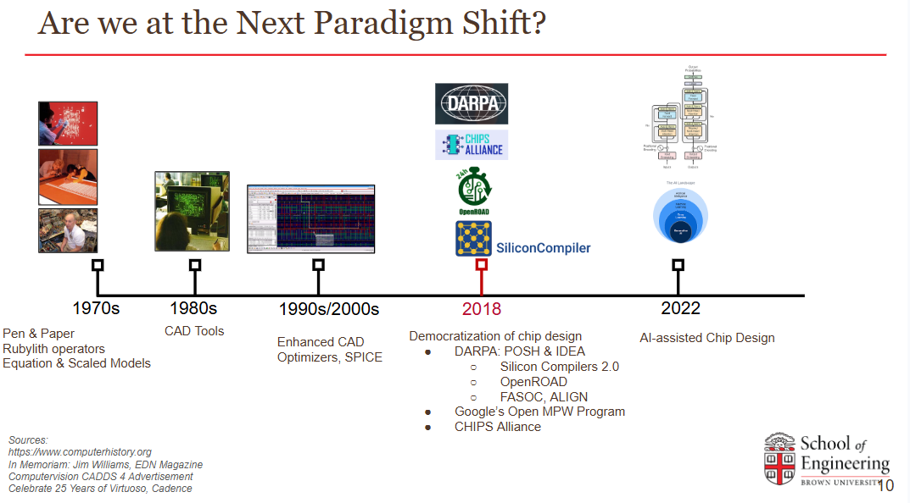

Mehdi Saligane is working to rethink not only how chips are designed, but also who gets to design them.    

His research brings together AI-assisted design, open-source electronic design automation, analog and mixed-signal automation, hardware-software co-design for AI, and secure and trusted hardware. Across these areas, one objective connects the work: making custom silicon more automated, reproducible, and accessible while expanding what specialized hardware can achieve.    

“AI is changing both the chips we need to build and the way we build them,” Saligane said. “We need new design methodologies that bring hardware, software, and machine learning much closer together.”    

#### Building an Open-Source Chip Design Ecosystem    

Saligane has been involved in the open-source silicon community since the early development of OpenROAD. As part of the founding OpenROAD Project team, he contributed to efforts that helped establish the project and demonstrate the potential of open, automated digital implementation flows.    

Within CHIPS Alliance, he has worked to strengthen the broader open-source hardware ecosystem. He has chaired the Analog Working Group, helping connect contributors across analog, mixed-signal, digital, and system-level design.     

The working group was created in response to what Saligane describes as “one of the major missing pieces in the open-source silicon ecosystem”: accessible infrastructure for custom and analog design.
But he sees analog automation as one part of a much larger opportunity.    

“The real opportunity is to rethink the entire chip design stack,” he said. “That includes design tools, reusable hardware generators, AI-assisted workflows, verification, system architecture, and the way hardware and software are co-designed.”    

That perspective shapes both sides of his work at the intersection of AI and hardware: using AI to design chips and designing specialized chips for AI.     

#### AI as a Design Partner     

*The evolution of chip-design methodologies, from manual design to open and AI-assisted workflows.*    

A major focus of Saligane’s research is the use of AI to assist engineers throughout the chip design process.     

His group investigates how large language models, machine learning, reinforcement learning, and code-based methodologies can support circuit generation, optimization, verification, physical implementation, and design-space exploration.    

Rather than treating AI as a replacement for engineers, Saligane views it as a way to increase their reach.    

“The goal is not simply to ask an AI system to design a chip,” he said. “The goal is to build reliable workflows in which AI can reason over specifications, generate and modify designs, interact with tools, learn from feedback, and help engineers explore much larger design spaces.”     

This work includes unexplored approaches to custom-circuit automation, natural-language and code-driven hardware design, and rapid power, performance, and area estimation using OpenROAD.     

The longer-term goal is to move beyond AI systems that generate isolated design artifacts toward systems that coordinate complete workflows across architecture, circuits, physical design, and verification.     

#### Designing Hardware for AI     

The relationship between AI and chip design also runs in the opposite direction: Saligane develops specialized hardware to make AI systems more efficient.    

His work includes hardware–software co-design for artificial intelligence and large language model acceleration, with an emphasis on reducing energy consumption, memory movement, and computational cost.     

These efforts explore new numerical formats, custom accelerators, compute-in-memory systems, and specialized architectures for efficient inference. Rather than adapting increasingly large models to conventional computing platforms, the objective is to co-design algorithms, representations, architectures, circuits, and software.    

“Efficiency cannot come from hardware or algorithms alone,” Saligane said. “The biggest gains come when models, numerical representations, architectures, circuits, and software are designed together.”    

Security is another dimension of this work. His group studies roots of trust and hardware architectures that provide stronger guarantees for computation and data integrity, particularly when AI models are deployed at the edge.    

#### Automating Analog and Mixed-Signal Design     

These broader ambitions still depend on custom circuits. Analog and mixed-signal blocks connect computation to the physical world through sensing, communication, power management, security, and data conversion.    

Yet their diversity makes them particularly difficult to automate. “Analog design is fundamentally heterogeneous,” Saligane said. “It is like a sea filled with islands, each one different. Digital design, in contrast, is more like a continuous continent.”     

Temperature sensors, operational amplifiers, data converters, biometric interfaces, and power converters each present distinct topologies, constraints, and physical-design challenges. The goal, therefore, is not to force every circuit through a single methodology, but to identify reusable architectures and abstractions that enable scalable automation.      

OpenFASOC, an open-source project led by Saligane within the CHIPS Alliance ecosystem, advances this approach through circuits that are “analog-functioning but digital-friendly.” These architectures preserve analog functionality while allowing substantial portions of their implementation—including synthesis, placement, routing, and verification—to be automated.    

Through OpenFASOC and related efforts, Saligane and his collaborators have completed tapeouts spanning sensing, power management, and hardware security. These include sensor arrays, digitally generated analog blocks, a GlobalFoundries 12 nm DC–DC converter, biometric analog front ends, and root-of-trust designs, including a recent implementation in the Intel 16 process.    

The broader methodology is now being extended toward fully open-source security hardware, AI accelerators, and frameworks for generating increasingly heterogeneous systems.

#### Bringing Software Discipline to Hardware    

Automation at this scale requires more than new algorithms. It also requires the software-engineering discipline needed to make tools and results reusable.    

Saligane’s team has adopted Python-based design packages, Docker containers, automated testing, continuous integration, and GitHub-centered development. These practices allow researchers and engineers to reproduce environments, validate changes, and build on previous work rather than reconstructing each design flow from the beginning.    

Such infrastructure has enabled the automated generation and evaluation of thousands of designs.    

Reproducibility is one of the motivations behind Saligane’s early involvement in open-source hardware.    

“I strongly believe open source could solve the reproducibility problem,” he said. “We knew it would be an uphill battle. But what kept me going was exploring new approaches to achieve minimal or no human-in-the-loop design.”    

That experience led to a broader lesson: publishing source code is only the beginning. Reproducibility depends on the infrastructure surrounding it. Sustainable hardware projects need clear documentation, stable interfaces, automated tests, practical examples, maintained tool environments, and communities capable of carrying the work forward as individual contributors move on.    

#### Expanding Who Can Design Chips     

For Saligane, democratizing chip design means enabling people from computer science, physics, biology, and other fields to turn their domain expertise into specialized hardware.    

A leading example is the IEEE SSCS Chipathon, which he co-founded and has helped develop into a global open-source chip design initiative. This year, nearly 1,000 participants are pursuing projects spanning analog and digital design, AI hardware, sensing, security, and design automation. The program now combines training, mentorship, collaborative reviews, open-source tool development, and pathways toward fabrication.    

Saligane chairs the IEEE SSCS Technical Committee on Open-Source Ecosystem, or TC-OSE, and emphasizes that this growth reflects the work of the entire committee and its volunteers. The committee is also working toward a conference centered on the Chipathon, where participants can present and benchmark complete, reproducible designs.    

“We want participants to be able to say, ‘I built the best-performing open-source ADC’ or ‘I built the lowest-power open-source SoC’ and back that claim with an open methodology and results others can reproduce, verify, and build on,” Saligane said.    

For him, open-source silicon is not simply about releasing tools or design files. It is about building an ecosystem that expands not only how chips are designed, but also who gets to design them.    

