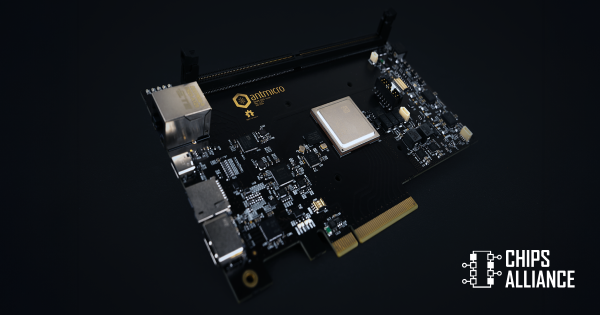
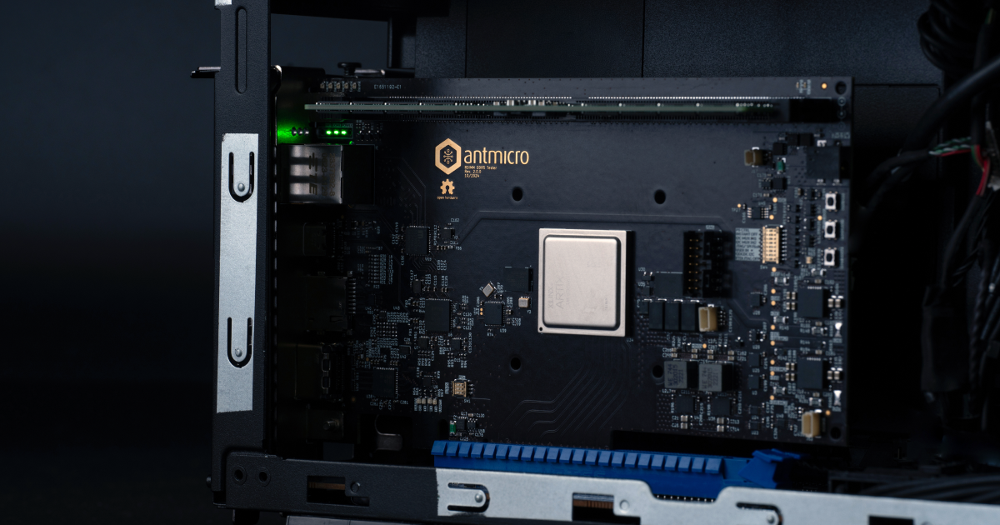
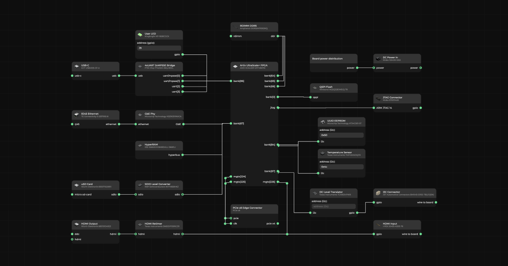

A few years back, Antmicro introduced the first DDR5 capable platform to the open source [FPGA-based Rowhammer research framework](https://github.com/antmicro/rowhammer-tester) developed in cooperation with Google - the [Data Center RDIMM DDR5 Tester](https://antmicro.com/blog/2022/08/extending-the-open-source-rowhammer-testing-framework-to-ddr5/). The follow-on [SO-DIMM (LP)DDR5 Tester](https://antmicro.com/blog/2024/02/versatile-so-dimm-lpddr5-rowhammer-testing-platform/) later extended the framework’s coverage to both SO-DIMM DDR5 modules and LPDDR5.

In this article, Antmicro introduces and provides an overview of a [new revision of the RDIMM DDR5 Tester](https://github.com/antmicro/rdimm-ddr5-tester) employing a more recent [AMD Artix UltraScale+ XCAU25P](https://designer.antmicro.com/hardware/devices/amd-xilinx-xcau25p-2ffvb676i) FPGA as compared to Kintex-7 series used in the previous revision. Artix UltraScale+ is a next-gen series of AMD (Xilinx) FPGAs with higher density of logic cells, higher I/O bandwidth, as well as more High Performance (HP) I/Os with a broader operating voltage range - all of which translate to concrete benefits for the platform, described below.

The main purpose of this board remains the same as the original, i.e. RDIMM DDR5 memory vulnerability testing to enable demonstrating new and mitigating known Rowhammer-class attacks, but the latest revision brings more flexibility to use the board as a generic development platform with a fully customizable soft memory controller. On top of an HDMI interface connector (also found in the [first revision](https://designer.antmicro.com/hardware/devices/data-center-rdimm-ddr5-tester?hw-release=rev.1.0.0)), the new iteration introduces additional features such as a separate I2C/I3C connector and a PCIe x8 connector which lets you install the tester inside a host platform such as a PC or a server rack, as well as cluster multiple units using customized backplanes.

The Data Center RDIMM DDR5 Tester rev. 2.0 is available in Antmicro’s [System Designer](https://designer.antmicro.com/welcome) where you can explore all the platforms Antmicro developed so far within the [Rowhammer project](https://designer.antmicro.com/projects/rowhammer_tester/overview), and more.

### Extended compatibility, PCIe and more

Compared to its Kintex-7‬ XC7K160T-based predecessor, the 2.0 revision of the RDIMM DDR5 Tester offers a more powerful Artix UltraScale+ XCAU25P FPGA based on a 16nm lithography process, with 308K System Logic Cells, maximum data rate of 2400Mb/s and 304 I/O pins. 

A higher number of HP I/Os allows for compatibility with a wide range of RDIMM DDR5 rank configurations as well as support for 8-bit ECC (x80 EC8 RDIMM), while their broader operating voltage - spanning from 0.85V (or even 0.72V for some speed grades) to 1.8V - makes them better fitted for RDIMM DDR5 operating at an I/O voltage (VDDQ) of 1.1V.

Although the board targets the [XCAU25P](https://designer.antmicro.com/hardware/devices/amd-xilinx-xcau25p-2ffvb676i) FPGA, it’s also pin-compatible with other members of the UltraScale+ family which offer even more resources, including AU25P (Artix US+), KU3P (Kintex US+, 356k logic cells) and KU5P (Kintex US+, 475k logic cells).

<video class="postimgcenter" width="auto" height="auto" controls="" autoplay muted loop>
    <source src="DDR5-tester-update-animation.mp4" type="video/mp4">
</video>

Like its predecessors, the board is meant to embed a soft memory controller and PHY entirely in the FPGA fabric, letting you exercise fine-grained control over the memory controller behavior, as opposed to wrapping around an ASIC hard block. Another use case on top of Rowhammer and other security research is thus also experimenting with and fine-tuning novel memory controller designs before they get embedded into an ASIC. While a fully FPGA-synthesized memory controller can’t achieve the speed of an ASIC hard block, the Artix UltraScale+’s I/O does offer a faster data rate than the Kintex 7 counterpart. 

Another major change in the new revision involved exposing a PCIe connector and altering the board’s form factor into a PCIe-compliant card. This allows Antmicro to install the tester inside host platforms (e.g. PC or server racks) but also cluster them with customized backplanes. The PCIe connector additionally enables off-loading memory content much faster than it was possible with Ethernet. The PCIe connector is gen 3 x8 capable and makes the board possible to integrate with the [DRAM Bender](https://github.com/CMU-SAFARI/DRAM-Bender) framework developed by ETH Zurich for experimental research on DRAM chips. The DDR5 Tester can also work as a standalone device on which you could build and boot Linux.

The on-board HDMI IN and OUT makes the board useful not only as a DRAM tester but also for developing video processing IP cores. The HDMI is connected to GTX transceivers capable of HDMI 2.0 speeds. Optionally, there is also a micro-coax connector for HDMI input, which allowed Antmicro to implement an HDMI grabber/video processing system on the board.

Antmicro also added a separate I2C/I3C connector as well as a heater connector (PWM control capable) to enable testing scenarios in which the impact of DRAM module temperature is analyzed.

Both the previous and the new revision of the Data Center RDIMM DDR5 Tester are available in Antmicro’s [System Designer](https://designer.antmicro.com/hardware/devices/data-center-rdimm-ddr5-tester) where you can explore and compare their interactive 3D renders, component lists and block diagrams, such as the one shown below.

### Vertically integrated Data Center solutions with Antmicro

Antmicro’s constantly expanding ecosystem of memory testing platforms allows them and their partners to develop Rowhammer and related attack countermeasures for state-of-the-art data center memory modules to increase data center security. On top of developing security research platforms, Antmicro offers many other services for advanced data center use cases, including development of BMC and [Root of Trust solutions](https://antmicro.com/blog/2024/10/support-for-veer-el2-with-user-mode-and-pmp-in-tock-os/), scalable compute clusters, custom CI runners and hardware-in-the-loop testing rigs.

If you’re interested in [developing a custom hardware platform with Antmicro](https://offering.antmicro.com/#/hw-process), such as [FPGA-driven design for video processing](https://offering.antmicro.com/#/af-video) or [compact, high-performance compute nodes](https://antmicro.com/blog/2024/11/com-express-baseboard-type-7/), don’t hesitate to reach out to them at [contact@antmicro.com](mailto:contact@antmicro.com).
