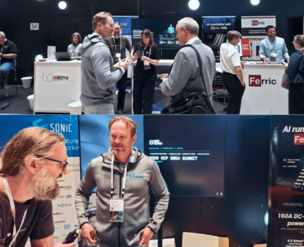

CHIPS Alliance participated in the 2026 OCP EMEA Summit on April 29-30 in Barcelona, Spain. [The Open Compute Project Foundation reported](https://www.opencompute.org/blog/2026-ocp-emea-summit-by-the-numbers) that more than 2,100 attendees from 52 countries attended the event, which featured 325 speakers across 190 sessions focused on AI and cloud data centers, security and data protection, power and cooling, and deployments of OCP-recognized equipment in EMEA data centers.   

#### Community Engagement and Presence   

At the CHIPS Alliance booth, alongside the [SONiC Foundation](http://sonicfoundation.dev/) and [Open Programmable Infrastructure (OPI)](https://opiproject.org/), representatives from Google and Antmicro met with attendees to discuss open source silicon development and current work across the CHIPS Alliance ecosystem.   

[Antmicro demonstrated Guineveer, a CHIPS Alliance-hosted RISC-V reference design based on the VeeR EL2 core](https://www.chipsalliance.org/news/designing-modular-and-reusable-risc-v-socs-with-topwrap-and-guineveer/). Guineveer is designed as a simple and extensible baseline for custom SoC development using VeeR, and can be architected and modified using the open source [Topwrap](https://github.com/antmicro/topwrap) digital design aggregation framework.   

   

#### Reflections   

As always, the OCP Europe Summit’s attendance has beat anticipation, and CHIPS’ booth presence fostered some great discussions on the show floor around many CHIPS Alliance projects, including Caliptra, VeeR, sv-tools, Chisel and others as well as new project ideas around emulation, security and memory. A number of prospective members have also approached CHIPS Alliance at the event, some of whom - including Qualcomm - have since joined CHIPS.    

#### Technical Sessions and Contributions   

Several technical sessions at OCP EMEA 2026 featured contributors from CHIPS Alliance member organizations and highlighted technologies developed within the community. [Check out the full playlist here.](https://youtube.com/playlist?list=PLWm-dtUGVJtDrlp3GGgvsN_6kiJ4xYOSU&si=GvjdWK7lVPnQIXdV)   

- **[Keynote: The Fungible Data Center: A Blueprint for the AI Era](https://www.youtube.com/watch?v=40TXPcnPhbs)**   
  - **Speaker:** Amber Huffman (Google)   
  - **Technical Focus:** Development of Google's "fungible data center" blueprint for the AI era, designed to support diverse accelerators, including TPUs and GPUs. The session covered the Open Compute Project Foundation Open Data Center specification, Project Deschutes liquid cooling, Mount Diablo power delivery, and Google's work across AI hardware, security, storage, and networking, including Caliptra, delivered in partnership with OCP and CHIPS Alliance.    

- **[Keynote: Scaling Trusted AI Infrastructure](https://www.youtube.com/watch?v=7CEef0wXQ6Y)**   
  - **Speaker:** Bryan Kelly (Microsoft)   
  - **Technical Focus:** Sovereign cloud architecture built on open source hardware security technologies including Caliptra, OCP SAFE, and confidential computing. The presentation also previewed OCP work on hardware partitioning and isolation for AI platforms.    

- **[Composable Security Architecture Episode 4: Bringing Together Platform Ingredients](https://www.youtube.com/watch?v=XJR7q4OFEM0)**
  - **Speakers:** Louis Ferraro (AMD), Miguel Osorio (Google), Marvin Gudel (9elements)   
  - **Technical Focus:** Development of OpenPRoT, an open source Platform Root of Trust firmware stack. The session introduced a standardized PRoT module connector for DC-SCM boards and demonstrated configurations for Endpoint RoT and Orchestrator RoT.   

- **[Caliptra as Server Security Hub](https://www.youtube.com/watch?v=nzkUoH8ymfs)**   
  - **Speakers:** Phanikumar Kancharla (Marvell) and Craig Barner (Marvell)   
  - **Technical Focus:** Hardware-managed Key Distribution Protocol (KDP) using KMTx and KMRx endpoints to provision Bus Encryption Keys and Data Encryption Keys across SoC and UCIe die-to-die connections anchored to Caliptra.   

- **[Caliptra Trademark Audit: A Practitioner's Guide](https://www.youtube.com/watch?v=UglxMq5iEio)**   
  - **Speaker:** Jasper van Woudenberg (Keysight Technologies)   
  - **Technical Focus:** Practical guidance on preparing RTL, ROM, and firmware documentation for the Caliptra Trademark Audit process and navigating OCP SAFE requirements.   

- **[Secure RPMC and Flash Key Provisioning Using Caliptra‑SS](https://www.youtube.com/watch?v=MngLPrOKmpk)**   
  - **Speakers:** Emre Karabulut (Microsoft) and Vishal Soni (Microsoft)   
  - **Technical Focus:** Hardware-anchored provisioning of Replay Protected Memory Block (RPMC) and flash encryption keys using the OCP LOCK mechanism and the Caliptra secure subsystem.   

- **[Towards a European Open Infrastructure: Insights from HIGHER- CAPE- and CHORYS](https://www.youtube.com/watch?v=vAi5VQtN2bM)**   
  - **Speakers:** Jens Hagemeyer (University of Bielefeld), Manolis Marazakis (FORTH), and Philippe Bonnet (University of Copenhagen)   
  - **Technical Focus:** European Horizon projects leveraging RISC-V and Arm for modular infrastructure, including a DC-SCM based on Caliptra RTM and RISC-V near-data processing in SSDs and NICs.    

#### Get Involved      

The discussions in Barcelona reflected growing interest in open, interoperable technologies across the infrastructure stack, from hardware security and silicon IP to the systems that support large-scale AI deployments.   

We appreciate everyone who visited the CHIPS Alliance booth and the members and contributors who shared their work throughout the summit.   

We invite you to get involved in CHIPS Alliance. Learn more about how to [get started](https://www.chipsalliance.org/getting-started/), join a [project](https://www.chipsalliance.org/projects/) or subscribe to a Working Group [mailing list](https://www.chipsalliance.org/workgroups/). Or, keep up to date with CHIPS Alliance by connecting with us on [LinkedIn](https://www.linkedin.com/company/chipsalliance/?viewAsMember=true) and subscribe to our quarterly [newsletter](https://www.linkedin.com/build-relation/newsletter-follow?entityUrn=7341146987217502211).    
