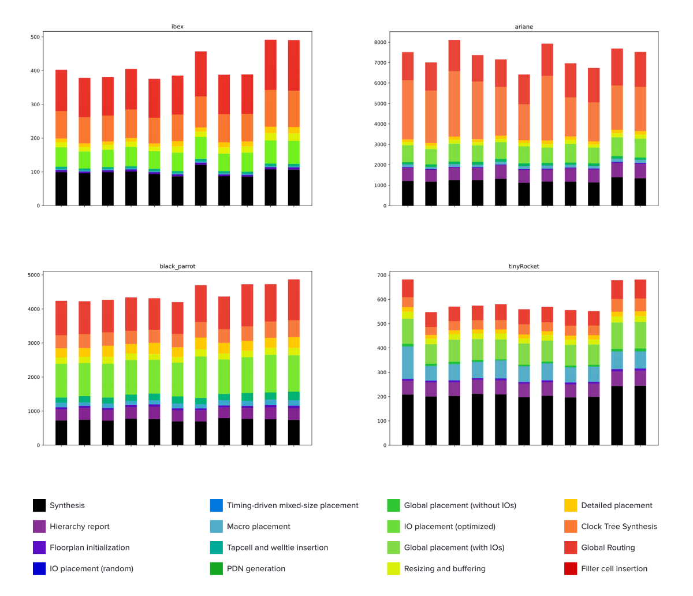
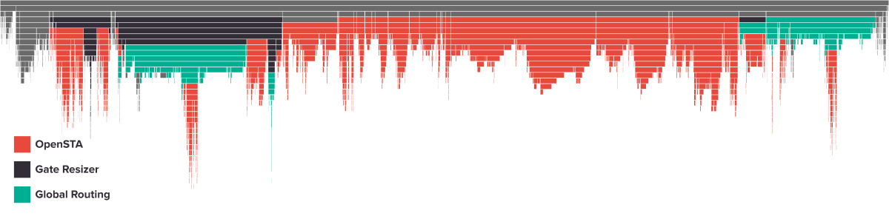
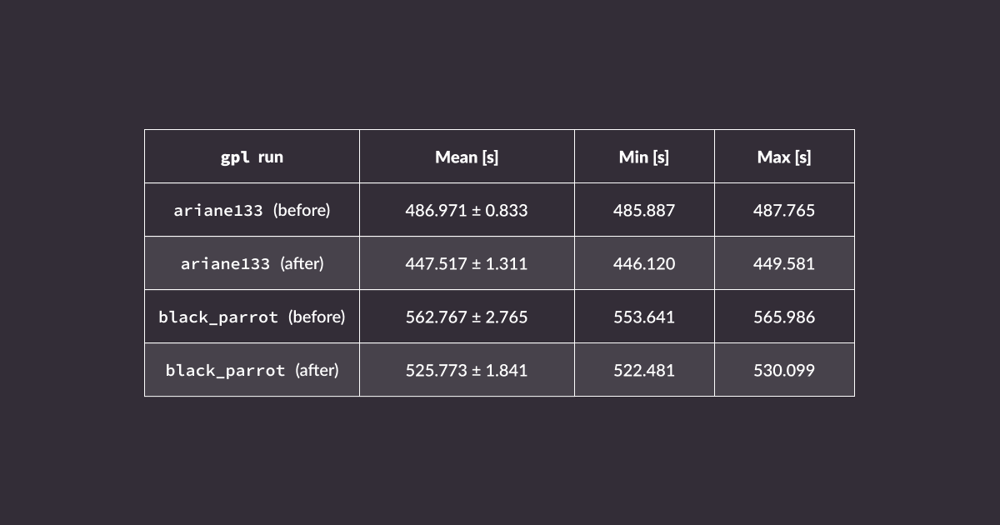
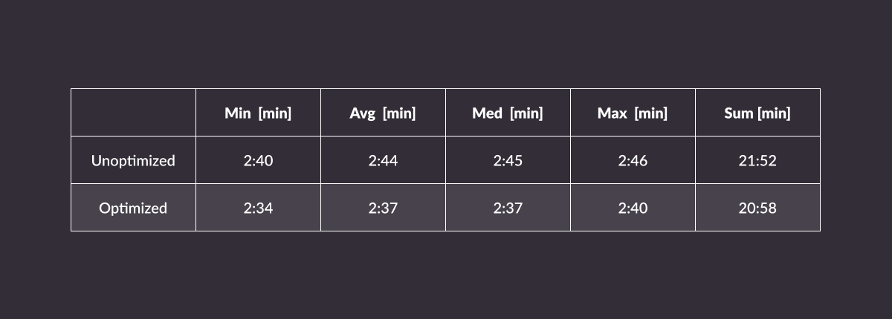
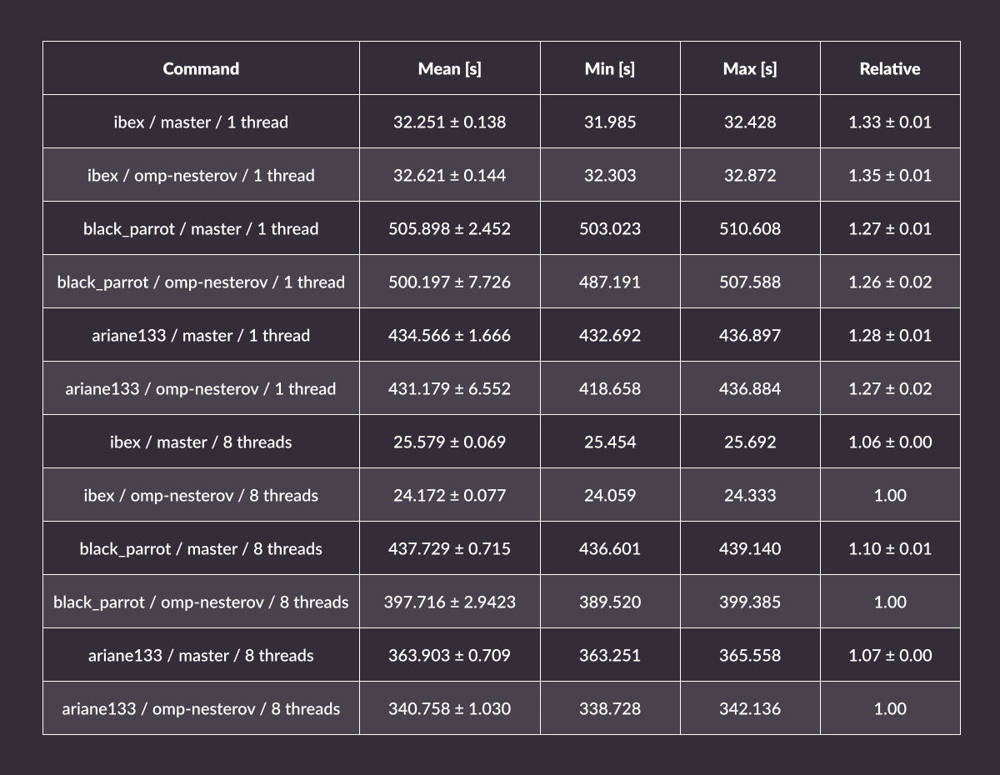
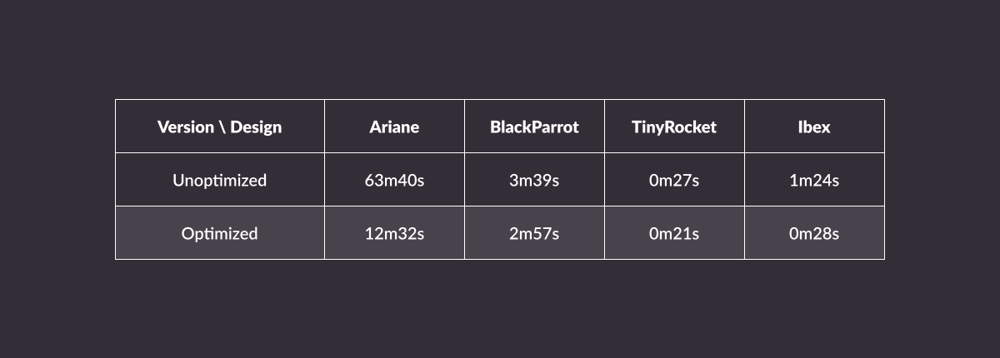

The [OpenROAD](https://theopenroadproject.org/) project provides an open source ASIC toolchain that reduces the entry barriers to the field of hardware development and allows fast-turnaround feedback about designs, helping to increase the productivity of silicon teams. As such, it’s a great supporting tool, increasingly used in state-of-the-art industrial projects alongside other open source tools like Verilator. 

Antmicro has been helping early adopters of OpenROAD-based flows in projects such as [SkyWater Shuttle](https://antmicro.com/blog/2021/12/sw-driven-asics-with-skywater-shuttle/), [OpenTitan](https://antmicro.com/blog/2023/03/adapting-opentitan-for-fpga-prototyping-and-tooling-development/) or more recently, Google’s [XLS](https://antmicro.com/blog/2023/09/accelerating-digital-block-design-with-googles-xls/). As a result, there is an increasing amount of interest in improving the performance of OpenROAD to yield faster turnaround times, especially for large and complex designs.

In this article, Antmicro describes the intermediate results and workflow of a current project focusing on improving execution time of the [mainstream OpenROAD flow](https://github.com/The-OpenROAD-Project/OpenROAD-flow-scripts) at the Floorplan, Placement, Clock Tree Synthesis and Routing stages. The objective is to suggest technical, general software optimizations, e.g. improving data structures or refactoring code for efficiency and scalability. This description focuses on methodologies Antmicro used for identifying bottlenecks in the flow, optimizations introduced, as well as considerations and suggestions for the future of the project.

To reliably assess wall-clock runtime and locate potential bottlenecks in the process, several profiling tools have been used:

* Valgrind’s [Cachegrind](https://valgrind.org/docs/manual/cg-manual.html) and [Callgrind](https://valgrind.org/docs/manual/cl-manual.html) - allows to collect precise information on cache usage, as well as generate a graph of calls that are easily portable and supported by various tools, such as KCacheGrind or speedscope (making it especially handy for Continuous Integration pipelines),
* Linux’s [perf tool](https://perf.wiki.kernel.org/index.php/Main_Page) - a capable profiling tool utilizing Performance Monitoring Unit in hardware to collect runtime statistics directly from the CPU, instead of using e.g. simulation (as in Valgrind) to collect such metrics on a software level, giving detailed information on processing time without introducing any significant overhead, which is especially useful during local development
* [pprof](https://github.com/google/pprof) and related tools that allow to visualize results from `perf` in the form of flamegraph, runtime graph demonstrating time spent on a given method and in total with its callees,
* [Intel VTune Profiler](https://www.intel.com/content/www/us/en/developer/tools/oneapi/vtune-profiler.html) to cross-reference the results gathered the otherwise open source toolkit with another widely-used tool.

As regards to testing targets, from the example designs available in the OpenROAD flow scripts repository, several RISC-V cores of various complexity have been selected, each of which represent realistic use cases of the OpenROAD flow and are therefore expected to exercise all of its individual algorithms.

* [tinyRocket](https://github.com/The-OpenROAD-Project/OpenROAD-flow-scripts/tree/master/flow/designs/src/tinyRocket) - a size-reduced version of [rocket-chip](https://github.com/chipsalliance/rocket-chip),
* [Ariane](https://github.com/The-OpenROAD-Project/OpenROAD-flow-scripts/tree/master/flow/designs/src/ariane) - an earlier version of [CVA6](https://github.com/openhwgroup/cva6),
* [Ibex](https://github.com/The-OpenROAD-Project/OpenROAD-flow-scripts/tree/master/flow/designs/src/ibex) - lowRISC’s [Ibex core](https://github.com/lowRISC/ibex),
* [BlackParrot](https://github.com/The-OpenROAD-Project/OpenROAD-flow-scripts/tree/master/flow/designs/src/black_parrot) - a modified version of [black-parrot](https://github.com/black-parrot/black-parrot) with memory blocks generated using [bsg_fakeram](https://github.com/bespoke-silicon-group/bsg_fakeram) for nangate45 PDK.

As they are open source, the designs also have the benefit of being fully reproducible, and the related performance results can be published to facilitate collaborative workflows for measuring and improving OpenROAD performance.

## Performance evaluation CI flow

To get a dependable environment for measuring performance improvements, a CI flow was developed that runs the profiling and generates reports on performance changes. The CI setup runs the OpenROAD toolchain for the four reference designs, then builds them using [OpenROAD-flow-scripts](https://github.com/the-OpenROAD-Project/openroad-flow-scripts). The OpenROAD project is then checked out to the branch that is being profiled, together with its submodules.

For each design, OpenROAD is run in four modes:

* Release - to verify the performance of the optimized code. The design is built 10 times in order to determine an average duration of each stage; all other modes are executed once.
* GProf - built with `-g -pg` compiler flags to enable profiling via `gprof`.
* Callgrind - run with Valgrind’s Callgrind tool.
* Intel VTune Profiler - to profile and detect hotspots in optimized code.

Each design is tested whenever changes are applied on development branches. The ASIC build process in OpenROAD is divided into passes, such as synthesis, floorplanning, placement, clock tree synthesis, or global routing. The optimizations Antmicro is introducing can affect multiple passes (e.g. one algorithm used in several passes) and sometimes the results of a single pass can further affect the passes that follow. Due to this, the flow tests the performance of all passes for the implemented optimizations.

The results for each pass are returned as a CI job artifact which contains the log, `gprof` output, Callgrind output, VTune output, and build results. These can be later used to generate column charts representing the duration of every stage in each run:

Additionally, Antmicro has used SpeedScope flamegraphs to visualize how each function from the Callgrind run affects the overall execution, as shown in the example below:

By creating an auto-generated [report](https://github.com/antmicro/openroad-callgrind-report) presenting Callgrind results for the design build steps in the OpenROAD project, it was possible to determine bottlenecks in the code and discuss the findings. The interactive report is in the process of being expanded to cover more graphs like the ones depicted above.

Below are the most impactful changes introduced so far to the OpenROAD project; the project continues, under active development by both Antmicro as well as other contributors.

## Floorplan and Placement optimizations

Functions used for setting macro positions in the OpenROAD flow contain conditionals that depend on unused data fields. Even though these conditions are always fulfilled, they were still being checked extremely frequently, which negatively impacted performance. By [removing](https://github.com/The-OpenROAD-Project/OpenROAD/pull/4505) these superfluous conditions, a ~20% reduction has been achieved in macro placement execution time on Ariane.

When it comes to the Global Placement stage, Antmicro has implemented several improvements. By [reducing](https://github.com/The-OpenROAD-Project/OpenROAD/pull/4507) the number of pin location lookups in the Steiner tree construction, Global Placement has been sped up by about 7-8%, as shown in the table below. The number of such reads can potentially be reduced further, but this will require redesigning some data structures.

The `pdr::get_nearest_neighbors()` function has also been [adjusted](https://github.com/The-OpenROAD-Project/OpenROAD/pull/4506) to use a single static vector instead of multiple separate ones. It also made the lambda used in that function capture a vector by reference instead of by copy. This resulted in fewer allocations, better cache coherence and reduced the amount of copying, yielding a 5-8% speedup in Global Placement.

In the Detailed Placement stage, a few simple optimizations have been introduced to the `DetailedMis::gatherNeighbours` function. Those change the type of the container, simplify the conditions and reorder them, and evaluate a function call only if needed, resulting in Detailed Placement runtime decrease by ~4.7% (as measured on BlackParrot).

The Placement stage now includes initial attempts to parallelize the execution: there is one loop in the multi-bit flip-flop (MBFF) pass marked with an OpenMP pragma. As OpenMP is already a dependency of Global Placement, OpenMP to [parallelize Nesterov’s method](https://github.com/The-OpenROAD-Project/OpenROAD/pull/4580) for the gradient optimization which is used by this stage. This resulted in a 6% speedup of Global Placement in Ibex, 10% in BlackParrot, and 7% in Ariane.

## Global Routing optimizations

The Global Routing stage consists of a small part of OpenROAD-specific code, with the majority taken up by the [Gate Resizer (RSZ) module](https://github.com/The-OpenROAD-Project/OpenROAD/blob/master/src/rsz/README.md) and the external [OpenSTA library](https://github.com/The-OpenROAD-Project/OpenSTA/). Below, the improvements to the former are outlined, as the work on OpenSTA improvements have not yet been incorporated into mainline OpenROAD.

Simultaneously `RepairSetup::rebufferBottomUp` has also been [optimized](https://github.com/The-OpenROAD-Project/OpenROAD/pull/4604), which used to take a significant amount of time during the repair after Clock Tree Synthesis, by implementing three types of changes:

* preallocating vectors, the final length of which is usually known in advance,
* caching values used by the comparison function during sorting done in the method in order to avoid redundant floating point calculations,
* reducing time complexity of option pruning at the end of the method from pessimistically quadratic to linear complexity.

These optimizations speed up CTS mostly for designs that require a significant amount of time for RSZ, such as Ariane, in which a ~80% time reduction has been observed during testing.

Averaged outcomes from 10 runs on the target designs are shown below:

## Introducing parallelism

The efforts described above have already resulted in significant runtime improvements, however, there’s still potential for even more optimizations that are currently being explored. 

One of the methods that could yield promising results is parallelization by scaling the flow on many CPU cores. In theory, this is the obvious thing to do, and - especially for large designs - the more cores, the better. In practice, however, parallelization requires synchronization of the processing threads and implementing additional critical section guarding to prevent race conditions and data corruption. These synchronization mechanisms, if overused, can significantly slow down performance, so any gain from parallelization might be lost on synchronization of the threads. The focus of this work is on finding such bottlenecks and improving synchronization so that even more processing threads can be spawned.

With this in place, it will be possible to scale up OpenROAD workloads into the cloud to yield even shorter turnaround times. On top of that, the design could be partitioned in order to spawn multiple parallel builds on many machines in the cloud, and without licensing limitations, users can potentially significantly shorten their ASIC development time.

## Adopt and improve open source flows with Antmicro

Developing, optimizing, integrating and improving open source workflows and toolkits is a large part of Antmicro’s day to day work for customer projects as well as their R&D. If you would like to identify and eliminate bottlenecks via integrating automated workflows in your project or adopt open source productivity tools that streamline your ASIC design and software work, reach out to Antmicro at [contact@antmicro.com](mailto:contact@antmicro.com).
