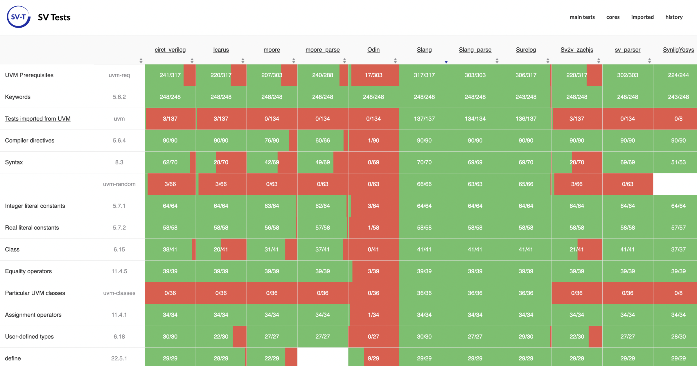

CHIPS Alliance, an organization operating under the Linux Foundation with the aim to foster collaborative, open source development in the silicon hardware design ecosystem, is happy to introduce the [SV Tools Project](https://github.com/chipsalliance/sv-tools) facilitating the development of high-quality, open source tooling for working with SystemVerilog (SV) codebases. With support from CHIPS Alliance members and collaborators, we've grouped together a suite of open source tools used for development of hardware leveraging SystemVerilog and the most common SV design verification methodology, UVM. The effort aims to provide better visibility and support for both project maintainers and users, and foster a more coherent open source tooling experience for various aspects of ASIC development and verification with SV/UVM.   

The SV Tools Project currently includes the [sv-tests suite](https://github.com/chipsalliance/sv-tests), the [Verible](https://github.com/chipsalliance/verible) toolkit, the [Synlig](https://github.com/chipsalliance/synlig) SV synthesis tool, and the [RISCV-DV](https://github.com/chipsalliance/riscv-dv) framework. In this article we take a closer look at each tool, show how they have been utilized so far, and how they can support productivity and collaboration in ASIC development workflows.   

#### SV-tests: support for SystemVerilog features across the open source landscape    

The [sv-tests suite](https://github.com/chipsalliance/sv-tests) is an important meta-tool laying the groundwork for all of SV tools' activities. It was originally developed to help identify the missing SystemVerilog features in various Verilog/SystemVerilog tools, including parsers, simulators, synthesis tools, linters and other tooling, using the SystemVerilog standard ([IEEE 1800-2017](https://standards.ieee.org/ieee/1800/6700/)) as a basis. This is achieved by running a large number of tests for each of the supported tools, the results of which are visualized in the form of an [interactive dashboard](https://chipsalliance.github.io/sv-tests-results/) that provides a comprehensive summary of the current support status.   

The sv-tests suite was introduced by CHIPS Alliance members Antmicro and Google [a few years back](https://antmicro.com/blog/2019/11/systemverilog-test-suite) and has since found broad use in other CHIPS projects such as [Verible](https://www.chipsalliance.org/news/integrating-language-server-protocol-in-verible/), as well as external ones such as [Verilator](https://www.chipsalliance.org/news/progress-in-open-source-systemverilog-uvm-support-in-verilator/). It is used extensively by various players in the industry to benchmark and improve coverage of the SV standard, and helps both prevent regressions and track the achievement of major milestones such as the [addition of UVM support to Verilator](https://www.chipsalliance.org/news/uvm-verilator/).   

#### Verible: automated SystemVerilog parsing and linting    

The versatile [Verible](https://github.com/chipsalliance/verible) suite, donated by CHIPS Alliance member Google, offers a wide range of SystemVerilog developer tools, including a parser, a linter and a formatter. It also features a [Language Server (LSP)](https://www.chipsalliance.org/news/integrating-language-server-protocol-in-verible/) that enables integration with various code editors, such as VS Code (through a [dedicated extension](https://github.com/chipsalliance/verible/tree/master/verible/verilog/tools/ls/vscode)) and Vim. Verible can be integrated into [CI at scale](https://www.chipsalliance.org/news/automatic-systemverilog-linting-in-github-actions-with-verible/) using the [Verible Linter Action](https://github.com/chipsalliance/verible-linter-action) and the [Verible Formatter Action](https://github.com/chipsalliance/verible-formatter-action).   

Verible has seen steady adoption and development over the years, being actively used and further extended in numerous CHIPS Alliance and other open silicon projects, including lowRISC's [Ibex](https://github.com/lowRISC/ibex) and CHIPS Alliance's [VeeR](https://www.chipsalliance.org/news/open-source-rtl-ci-testing-and-verification-for-caliptra-veer/) RISC-V CPU cores.   

#### Synlig: SystemVerilog synthesis   

[Synlig](https://github.com/chipsalliance/synlig), originally developed by Antmicro, is an open source SystemVerilog synthesis tool that uses [Surelog](https://github.com/chipsalliance/Surelog) as the preprocessor, parser and elaborator, and [Yosys](https://github.com/YosysHQ/yosys) as the framework for the synthesis. It allows parsing both SystemVerilog files and UHDM files, i.e. SystemVerilog files already processed by Surelog.   

Synlig's test suite includes a number of open source designs, including CHIPS Alliance's [VeeR](https://github.com/chipsalliance/Cores-VeeR-EH1), and lowRISC's [OpenTitan](https://github.com/lowRISC/opentitan) and [Ibex](https://github.com/lowRISC/ibex) cores.   

#### RISC-V DV: rigorous CPU verification   

The SV/UVM-based [RISCV-DV](https://github.com/chipsalliance/riscv-dv) framework contributed by Google, is an instruction generator for RISC-V processors, used for verifying features such as privileged modes (machine, supervisor and user) or trap/interrupt handling. The generated instructions are executed by the core under test and simultaneously by a reference RISC-V ISS (instruction set simulator), e.g. [Spike](https://github.com/riscv-software-src/riscv-isa-sim) or [Renode](https://github.com/renode/renode), and upon completion, the core states of both are compared after each executed instruction in terms of register writebacks.   

Such a co-simulation setup has been employed in the verification workflow of many cores in the RISC-V ecosystem, including but not limited to the [VeeR EL2 core](https://www.chipsalliance.org/news/open-source-rtl-ci-testing-and-verification-for-caliptra-veer/), as well as [Ibex](https://github.com/lowRISC/ibex/blob/master/doc/03_reference/verification.rst).

#### More converging developments: UVM support in the Verilator RTL simulator   

Besides the subprojects currently listed in the SV Tools Project, the long-running efforts to [enable UVM testbenches in Verilator](https://github.com/chipsalliance/uvm-verilator), consistently pushed forward by Antmicro, Wilson Snyder and numerous contributors from the open source RTL design community, have been converging into significant milestones, the most recent one being [support for upstream UVM 2017 in Verilator](https://www.chipsalliance.org/news/uvm-verilator/).   

Universal Verification Methodology (UVM) is a popular digital design verification method, integrated with many pre-existing workflows, tools and verification IP. Bringing UVM to the [Verilator](https://www.veripool.org/verilator/), which is both open source and widely adopted in the industry, is an important step on the way towards a fully open source ASIC development flow.   

#### Looking forward: next steps   

The SV Tools Project supersedes the previous entity referred to as 'SystemVerilog Tools working group'.   

To coordinate and formalize the workings of the SV Tools Project and the tools underneath its umbrella, a Technical Steering Committee has been appointed comprising the specific tool maintainers to oversee technical decisions in the Project. Regular TSC meetings will be held to discuss the ongoing developments in the specific tools and the broader ecosystem. These meetings will serve as a forum for reviewing proposals, prioritizing features, and coordinating work across the different components of the Project.   

The [sv-wg mailing](sv-wg@lists.chipsalliance.org) list will be renamed to sv-tools, and repurposed for project-specific announcements and discussions.   

The SV Tools TSC meetings, as per the CHIPS policy, will be open to the public (just like the SV Tools WG ones have been), and their new time will be posted in the README of the [SV tools GitHub repository](https://github.com/chipsalliance/sv-tools) once established by the initial TSC members.   

#### A collaborative ecosystem for open source-driven ASIC development   

CHIPS Alliance is [continuously working](https://www.chipsalliance.org/news/tac-whitepaper/chips-alliance-whitepaper.pdf) on bringing the scalability, flexibility and transparency of open source tools and methodologies to the ASIC development ecosystem. With the tools described in this article, we strive to facilitate large-scale adoption of open hardware, with hardware-software co-design and standardized development workflows.   

Follow the [SV Tools Project](https://github.com/chipsalliance/sv-tools) on GitHub to stay up to date with recent developments and the meeting schedule, and watch the [CHIPS Alliance blog](https://www.chipsalliance.org/categories/blog/) and [LinkedIn](https://www.linkedin.com/company/chipsalliance/) for news and updates.   