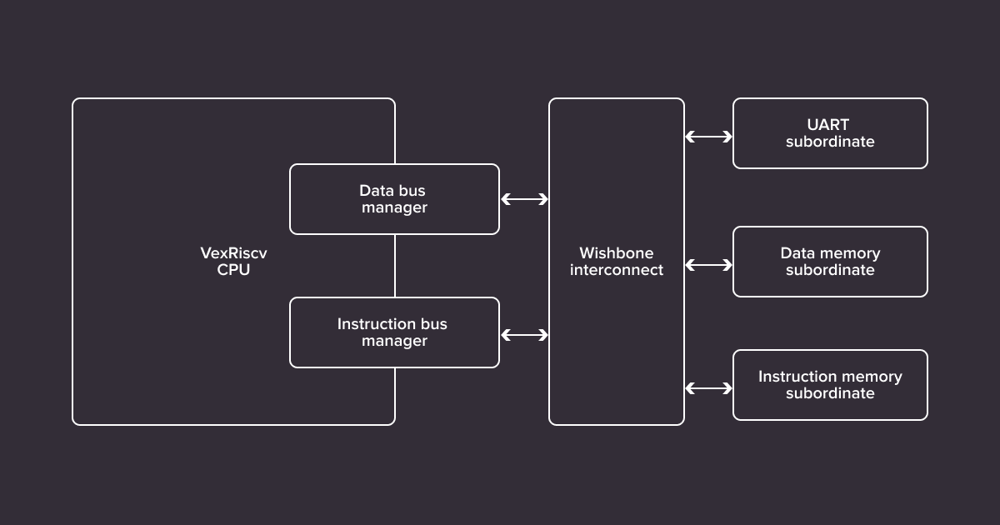
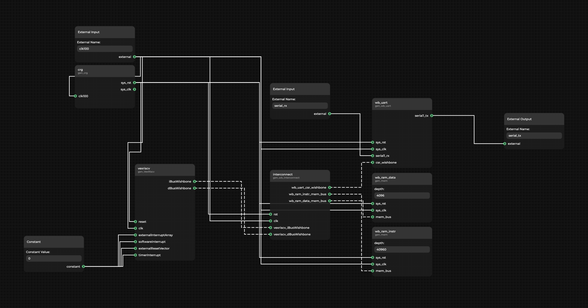

ASIC and FPGA designs consist of distinct blocks of logic bound together by a top-level design. Taking advantage of this modularity and enabling automation and reuse of blocks across designs requires tools for automated processing and generation of top level files, letting you easily parametrize and aggregate the blocks in various configurations.

To this end, Antmicro created [Topwrap](https://github.com/antmicro/topwrap), an open source toolkit for connecting individual HDL modules into full designs of varying complexity. The toolkit is designed to take advantage of the ever-growing library of open source digital logic blocks that they also [heavily contribute to](https://github.com/chipsalliance/i3c-core) and, thanks to its structuredness, offers a user-friendly graphical interface sitting on top of a well-formed CLI. This in turn lets you mix-and-match high-level GUI-driven design with more fine-grained CLI-level adjustments and present designs in the form of a diagram thanks to the integration with Antmicro’s [Pipeline Manager](https://antmicro.com/blog/2024/02/add-web-based-guis-with-pipeline-manager/).

In this article, Antmicro describes Topwrap’s core elements and most important features, go over how it can improve collaboration in digital design, and showcase its capabilities with a tutorial-style demo and an interactive diagram of a SoC with its top level designed using the toolkit.

### Automation and collaboration via machine- and human-readable top-level design

Creating top level designs by hand tends to be tedious and error-prone, especially in complex designs that Antmicro typically works with, and the resulting source files don't really provide a good overview of the overall architecture of the system. Many existing tools that offer automation of the ASIC/FPGA design composition process are centered around their specific ecosystems, be it in terms of the HDL language used or the specific SoC or toolkit they focus on, but given the broad nature of their work, they needed a more HDL, design and vendor-agnostic tool.

Topwrap makes composing designs more convenient by automatically connecting whole sets of signals bundled into interfaces, performing sanity checks and generating the necessary interconnects, while aiming at parametrization of designs at the top level, regardless of underlying methodologies. Top-level design is performed by providing YAML files that contain its description, which in itself should be easier than writing out the top level by hand in e.g. SystemVerilog, and thanks to a structured definition, this process can also be carried out in the [Pipeline Manager](https://github.com/antmicro/kenning-pipeline-manager) GUI, with the description files generated automatically.


This approach provides several benefits:

* Connecting HDL modules becomes much more straightforward, as instead of typing several lines of HDL code it requires just a few clicks.
* The implementation is self-documenting, as it automatically comes with a diagram of connections that never goes out of sync with the implementation.
* Diagrams help grasp the big picture, not only for hardware designers but also other team members; they help drive design discussions forward, both internally and with customers or partners, by having the architecture presented graphically.

Since the description files are simply plain text, using the GUI is completely optional. It also makes them suitable to be used with version control systems.

### Topwrap's core structure

Topwrap consists of three tools designed to simplify the process of creating top-level hardware wrappers:

* `topwrap parse` – automatically parses HDL modules and groups ports into interfaces to enable connecting them more conveniently in the design. This step is necessary, as it creates YAML module description files for the parsed modules, which are used by Topwrap internally. These conform to a [documented format](https://antmicro.github.io/topwrap/description_files.html#ip-description-files) and can also be written and adjusted manually as they are validated against a schema described using the [Marshmallow](https://marshmallow.readthedocs.io/en/stable/) library.
* `topwrap build` – generates the top level based on a design description file. It references files describing the HDL modules mentioned previously and describes all connections between them, external ports of the design, and, optionally, interconnects. To automate the project generation and build process, Topwrap can also generate e.g.[FuseSoC](https://github.com/olofk/fusesoc) files to simplify work with Topwrap-made designs in other tools
* `topwrap kpm_client` – spawns a Pipeline Manager client to provide a convenient GUI for creating designs. It can be accessed in the browser and allows placing and connecting the HDL modules via dragging & dropping. After a design is finished, sanity checks and building the design can be triggered from the GUI as well.

### Interface deduction, user defined repositories, and more

Topwrap’s development is moving fast – besides the GUI capabilities prominently featured in this note, some notable recent features include:

* Automatic generation of interconnects for the design. The interconnect is parameterized by data and address widths, the number of manager and subordinate interfaces and address ranges for the latter.
* Enhanced interface grouping mechanism – deduces the most probable interface for a set of ports of a module to simplify the process of describing the design later on. This feature supports interfaces from the AXI and Wishbone bus protocols.
* Support for user defined repositories – enables the management of previously created module description files and custom interface definitions and facilitates their reuse in other designs. A [pregenerated repository](https://github.com/antmicro/topwrap/releases/download/latest-20240517/core_repo.zip) of reusable open source modules that can be imported to the Topwrap project is available to speed up the development.

To learn more about the toolkit, its integration with Pipeline Manager and further enhancements planned for the future, refer to Topwrap’s [documentation](https://antmicro.github.io/topwrap/).

### Building a simple SoC with Topwrap

To showcase Topwrap’s capabilities, we'll build a simple System-on-Chip containing a [VexRiscv](https://github.com/SpinalHDL/VexRiscv) CPU that will come from Topwrap’s library of open source cores, memory and UART, and use it to send a "hello world" over UART. To tie it all together, we will use an interconnect generated with Topwrap. The [entire example](https://github.com/antmicro/topwrap/tree/main/examples/soc) is available in the Topwrap repository.

The diagram below shows the general structure of the final system.



To start off, the HDL sources containing the components listed above need to be parsed by Topwrap. For example, a file containing a memory module with a Wishbone interface can be parsed with:

```
topwrap parse --iface-deduce mem.v
```

As a result, Topwrap produces a module description in the YAML format containing all the necessary information for the module to be usable in Topwrap. Several heuristics are used to group signals under a single entity – an interface. Several interfaces can be connected together in one go.

The final file may look like this:

```yaml
name: mem
parameters:
  depth: 256
signals:
  in:
    - [sys_rst, 0, 0]
    - [sys_clk, 0, 0]
interfaces:
  mem_bus:
    signals:
      in:
        dat_w: [mem_bus_dat_w, 31, 0]
        ...
        we: [mem_bus_we, 0, 0]
      out:
        dat_r: [mem_bus_dat_r, 31, 0]
        ack: [mem_bus_ack, 0, 0]
    type: wishbone
    mode: slave
```

Notice the above contains the `name` of the module, as well as its `parameters`, `signals` (ports) along with their directions, and `interfaces` along with the bus `type`, direction (`mode`), and signal mapping of concrete ports to their specification names.

With these files, one per module, a design can be constructed. You can do this in two ways - by manually writing a design description YAML file, or by using the GUI.

The YAML design description specifies all parameters and connections between ports and interfaces. First, all modules (`ips`) have to be included by specifying their instance name (e.g. `vexriscv`), `file` path to the module description YAML, and the Verilog `module` name. The same core can be instantiated multiple times under different names:

```yaml
ips:
  vexriscv:
	file: ipcores/gen_VexRiscv.yaml
	module: VexRiscv
  wb_ram_data:
	file: ipcores/gen_mem.yaml
	module: mem
  wb_ram_instr:
	file: ipcores/gen_mem.yaml
	module: mem
  ...
```

Next, the description needs to specify the `external` ports. In this case,only clock and serial ports:

```yaml
external:
  ports:
    in:
      - clk100
      - serial_rx
    out:
      - serial_tx
```

The core of the description is the specification of all `parameters` of module instances and connections between modules, to external ports or constants (under `ports`). This is where grouping ports into interfaces pays off – instead of connecting dozens of signals between interconnect and other modules, it can be done in a single line (under `interfaces`):

```yaml
design:
  ...
  parameters:
	wb_ram_data:
  	    depth: 0x1000
  	    memfile: "top_sram.init"
	wb_ram_instr:
  	...
  ports:
vexriscv:
  	    clk: clk100
  	    reset: [crg, sys_rst]
  	    externalResetVector: 0x00000000
  	...
	wb_uart:
  	    sys_clk: clk100
  	    sys_rst: [crg, sys_rst]
  	    serial1_tx: serial_tx
  	    serial1_rx: serial_rx
	...
  interfaces:
	interconnect:
  	    wb_uart_csr_wishbone: [wb_uart, csr_wishbone]
  	    wb_ram_instr_mem_bus: [wb_ram_instr, mem_bus]
   	    wb_ram_data_mem_bus: [wb_ram_data, mem_bus]
  	    vexriscv_iBusWishbone: [vexriscv, iBusWishbone]
  	    vexriscv_dBusWishbone: [vexriscv, dBusWishbone]
```

The most convenient way to construct designs, however, is by using the diagram-based GUI integrated with Topwrap. The design made with it can then be exported to a design description file shown earlier, thus enabling version control. Below, you can see a diagram of the design:



Regardless of how they were created, the YAML files can be imported into the GUI again, providing a nice graphical render of connections for files written by hand. Textual or GUI-based, it’s up to you – no approach is favored over the other.

Now the design can be built – offering a top level with all the connections generated. Do this by either clicking the run button in the GUI or running the `build` command with the HDL `sources` directory, design description file (`project.yaml`) and build directory specified:

```
topwrap build --sources sources/ --design project.yaml --build-dir build/
```

This generates two files: the HDL file that contains just the top level, without other sources bundled, and a FuseSoC `core` file that lists all HDL dependencies.

The Topwrap toolkit is already being used in a number of complex projects Antmicro is involved with, including the development of an LPDDR4 controller within the EU-funded [TRISTAN](https://tristan-project.eu/) project focused on, among others, the development of an open source Ultra-Low Power DDR Memory Digital Interface for ultra-low power RISC-V based SoCs targeted at wearable applications.

### Open source-driven digital system design with Antmicro

Thanks to its readable and parsable YAML-based configuration and specification, combined with a growing library of open source digital blocks such as the ones developed within the CHIPS Alliance’s [Caliptra project](https://designer.antmicro.com/hardware/socs/caliptra_soc) that can be reused across designs, Topwrap offers a flexible methodology where designs can be easily reconfigured and customized. The toolkit’s GUI integration offers a capability to present and reason about complete designs (abstracting away implementation details but, thanks to the capability to add links to artifacts such as source code or verification dashboards, letting you dive into specifics where needed), making it valuable to collaboration between teams and across companies.

Near-term goals for Topwrap include integrating it with other tools to enable calling synthesis, P&R and simulation from the graphical interface, and co-simulation with [Renode](https://renode.io/) enabling end-to-end digital design from a single “command center” perspective.

From general purpose RISC-V-based processors through AI accelerators to computationally demanding edge AI processing solutions, Antmicro’s open source-driven tools and workflows, combined with [their engineering services](https://offering.antmicro.com/), helps their customers design, develop and finally bring new products to market faster and more reliably. With services including both RTL development and enhancing and implementing tools such as Topwrap, Renode, Verilator or cocotb for your organization’s needs, they offer support at any stage of the chip design process in demanding industries including automotive, space, AR/VR, and more.

If you’re interested in creating a digital design with Antmicro and would like to discuss your options, or if you would like them to expand Topwrap’s capabilities to best fit your use case, don’t hesitate to contact them at [contact@antmicro.com](mailto:contact@antmicro.com).
