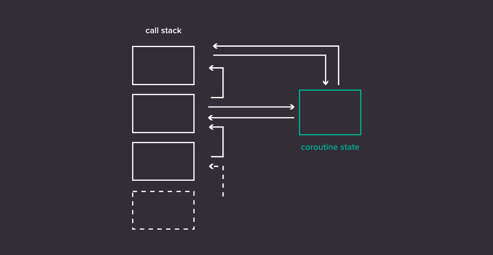
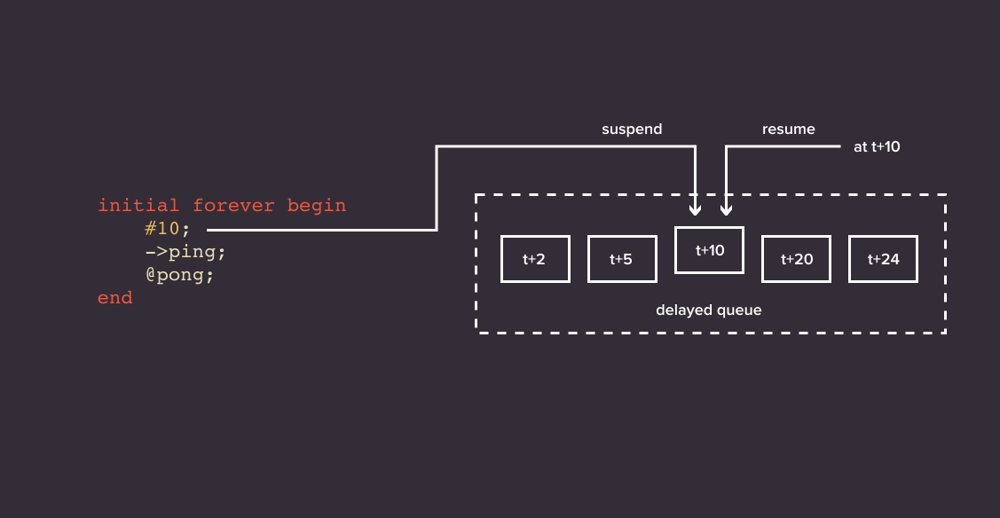

*This post was originally published at [Antmicro](https://antmicro.com/blog/2021/12/coroutines-for-dynamic-scheduling-in-verilator/).*

Verilator is a popular open source SystemVerilog simulator and one of the key tools in the ASIC and FPGA ecosystem, which Antmicro is actively using and developing, e.g. by [enabling co-simulation with Renode](https://antmicro.com/blog/2021/09/co-simulation-for-zynq-with-renode-and-verilator/) or [Cocotb integration](https://antmicro.com/blog/2019/06/verilog-with-cocotb-and-verilator/). It’s also one of the fastest available HDL simulators, including proprietary alternatives. It achieves that speed by generating highly optimized C++ code from a given hardware design. Verilator does a lot of work at compile-time to make the generated (‘verilated’) code extremely fast, such as ordering statements in an optimal way.


This static ordering of code also means that support for some SystemVerilog features has been sacrificed to make Verilator so performant. Namely, Verilator does not support what is known as the stratified scheduler, an algorithm that specifies the correct order of execution of SystemVerilog designs. This algorithm is dynamic by nature, and does not fit with Verilator’s static approach.

Because of this, it doesn’t support [UVM](https://en.wikipedia.org/wiki/Universal_Verification_Methodology), a widely-used framework for testing hardware design. Testbenches for Verilator have to be written using C++, which is not ideal – you shouldn’t have to know how to program in C++ in order to use a SystemVerilog simulator. Many ASIC projects out there are not able to take advantage of Verilator, because verification in this space is very often done with UVM. This is a gap that together with Western Digital, Google and the entire CHIPS Alliance we have been working to close, to enable fully open source, cloud-scalable verification usable by the broad ASIC industry.

## A milestone towards open source UVM

Some of the key features UVM requires are dynamically-triggered event variables and delays. To support them, we introduced to Verilator what we call a dynamic scheduler with a [proof-of-concept implementation](https://github.com/antmicro/verilator-dynamic-scheduler-examples) which we described in more detail in a [previous blog note earlier this year](https://antmicro.com/blog/2021/05/dynamic-scheduling-in-verilator/). Essentially, it enabled us to suspend execution of SystemVerilog processes when waiting for delays to finish or events to be triggered, thus postponing some of the scheduling from compile-time to runtime.

```
initial forever begin
    @ping;
    #1 ->pong;
end

initial forever begin
    #1 ->ping;
    @pong;
end
```

That thread-based implementation worked, but it required us to run each process in a design in a separate thread, using mutexes and condition variables to facilitate communication. With a working solution in hand, which proved that what we set out to do was possible, we started thinking about a different approach which would allow us to avoid the significant performance overhead introduced by threads and hopefully also simplify the implementation. That’s when coroutines came up as a possible solution.

## What is a coroutine?

The concept of coroutines [has been around for decades](https://en.wikipedia.org/wiki/Coroutine). Arguably, most programmers have used them, knowingly or not. They are available in some form for most modern programming languages, and now they are also included in the newest C++20 standard. But what are they exactly?

Normally, when a function or procedure is called, it needs to finish execution in order for the control flow to go back to a previously executed function. This is reflected in the way the call stack works. A coroutine is a generalization of the concept of a function, but it differs in that its execution can be paused at any point, and resumed from any other point in the program, even from a different thread. Implementations vary, but often this is achieved by allocating coroutine state on the heap.



Unlike threads which are commonly used in desktop operating systems, coroutines are a form of cooperative multitasking, meaning that they have to yield control by themselves – there is no scheduler controlling them from the outside. A programmer needs to specify when and where a coroutine should resume execution.

A popular use case for coroutines is writing generators. As the name suggests, a generator is used for generating some set of values, but instead of returning them all at once, it yields them one by one to the function that called the generator.

```
generator<uint64_t> fib(int n) {
    uint64_t a = 0, b = 1;
    for (int i = 0; i < n; i++) {
        b = b + exchange(a, b);
        co_yield a;
    }
}
```

```
for (uint64_t n : fib(40))
    printf("%d\n", n);
```

Coroutines are also useful for asynchronous programming, for writing functions that start their execution on one thread, but continue on another (i.e. a background thread intended for heavy computation).

```
ui_task click_compute() {
    label = "Computing...";
    co_await compute();
    label = "Finished!";
}
```

Currently, coroutines are supported by many C++ compilers, including GCC 11 and Clang 13 (which offers experimental support). It’s worth mentioning that Clang is excellent at optimizing them: if a coroutine does not outlive the calling function’s stack frame, and its state object’s size is known at compile time, the heap allocation can be elided. Coroutine state is then simply stored on the stack. This gives Clang a significant performance edge over GCC in some cases, such as when using generators.

## Coroutines for dynamic scheduling

From the get-go, coroutines seemed like a good fit for dynamic scheduling of SystemVerilog in Verilator. As previously mentioned, they follow the cooperative model of multitasking, which is sufficient for handling delays and events in SV processes. Preemption is not necessary, as there is no danger of starving a task. That is because all SystemVerilog processes should yield in a given time slot either after they finish or when they’re awaiting an event.

A significant drawback of threads, which was what the initial implementation was based on, is that it’s not possible to spawn thousands of them, one for each process in a design. However, it is possible to spawn thousands of coroutines, and that number is only bound by the amount of RAM available to the user. Also, with coroutines, one does not have to worry about multithreading problems like data races. All multitasking can be done on one thread.

The only issue with coroutines is the allocation of coroutine state. However, there are ways to mitigate that by using a custom allocator, as well as only using coroutines for the parts of a design that actually require it. After all, dynamic scheduling is not relevant to the synthesizable subset of SystemVerilog.

Thus, we decided to go ahead and replace threads with coroutines in our implementation. The new approach immediately proved to be easier to work with, and development pace increased significantly. The new version already surpassed the thread-based implementation in completeness as well as performance, and is [available here](https://github.com/antmicro/verilator-dynamic-scheduler-tests). Let’s take a closer look at how it works.

## Implementation

```
initial forever begin
    @ping;
    #1;
    ->pong;
end
```

```
while (true) {
    co_await ping;
    co_await 1;
    resume(pong);
}
```

The general idea for the implementation was to reflect the behavior of SystemVerilog delay and event trigger statements in the `co_await` statement in C++20. This statement is responsible for suspending coroutines, and we use it to suspend SystemVerilog processes represented by coroutines in a verilated design.

When a delay is encountered, the current coroutine (or process) is suspended and put into a queue. When the awaited time comes, the corresponding coroutine is removed from the queue and resumed.



Event variables work in a similar way. When we are awaiting an event, we suspend the current coroutine and put it in what we call an event dispatcher. If the event is triggered at a later point, we inform the event dispatcher which resumes the corresponding coroutine.


With all this, the C++ code that Verilator generates for delays and event statements is very similar to the original SystemVerilog source code.

```
initial forever begin
    @ping;
    #10;
    ->pong;
end
```

This SystemVerilog corresponds to the following C++ code. The snippet shown here is simplified for readability, but the structure of the verilated code is preserved.

```
Coroutine initial() {
    while (true) {
        co_await eventDispatcher[&ping];
        co_await delayedQueue[TIME() + 10];
        eventDispatcher.trigger(&pong);
    }
}
```

As mentioned before, one of the main reasons for the switch to coroutines is performance. The original, thread-based implementation was hundreds of times slower than vanilla Verilator when simulating CHIPS Alliance’s [SweRV EH1 core](https://github.com/chipsalliance/Cores-SweRV). Just replacing threads with coroutines resulted in 3-time speedup in SWeRV. Further optimization, the most crucial part being detecting which parts of a design need dynamic scheduling, resulted in indistinguishable performance between vanilla Verilator and our version when using Clang for verilated code compilation.

Next steps and future goals
There is still more work to be done. We are continuously working on improving the dynamic scheduler in the following areas:

working out some remaining edge cases,
making it work with Verilator’s built-in multithreading solution,
adding new test cases to push these new features to their limits.
Our goal is to provide the dynamic scheduler in Verilator as an optional scheduler that users can enable if they want more SystemVerilog compatibility. Of course users should bear in mind that it is not as well-tested as Verilator’s default behavior, but this will most likely improve as we find more practical use cases to make use of the solution.

Naturally, many more features are needed to provide full UVM support. This, among others, includes:

- the built-in `process` class, which is used for controlling the behavior of a SystemVerilog process,
- randomized constraints, which let the user generate test data easily by specifying constraints for random generation of said data,
- better support for assertions, which are statements that allow for verifying that certain conditions are fulfilled by a tested design.

The dynamic scheduler is part of a bigger undertaking driven by Antmicro within the CHIPS Alliance to create fully open source toolchains and flows for FPGA and ASIC development. Together with [Surelog/UHDM](https://antmicro.com/blog/2021/10/openlane-asic-build-flow-with-systemverliog-support/), a project aiming at providing a complete SystemVerilog parsing and elaboration solution, this brings us closer to being able to simulate, test and verify designs which use UVM with entirely open source tools.