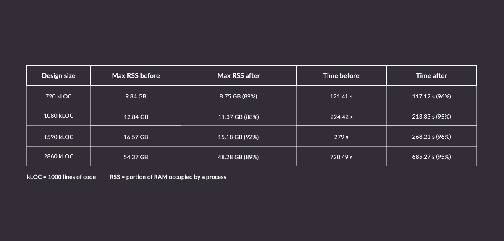
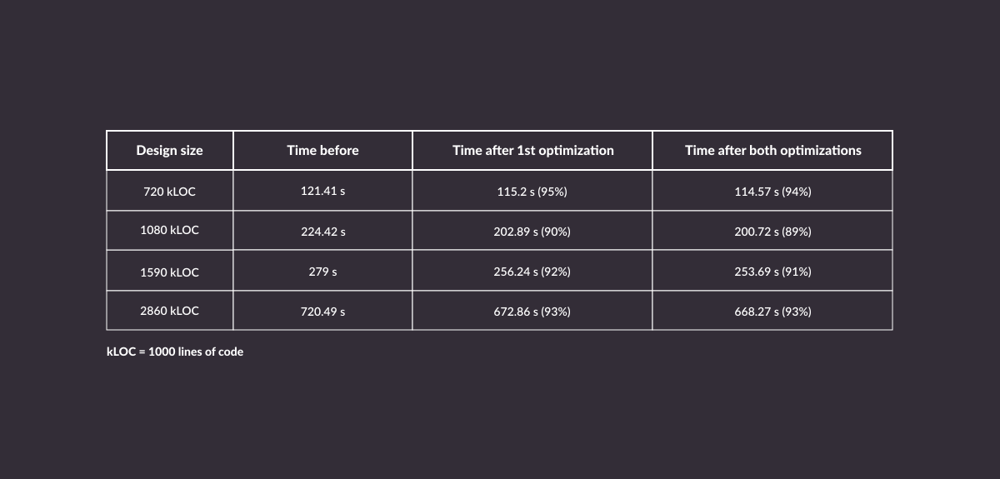
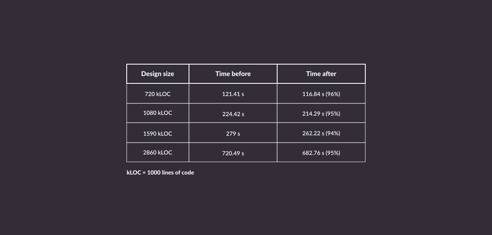

Verilator can boast the status of one of the most widely used free and open source digital design tools for ASIC and FPGA development. To stay on top of the ever-increasing complexity of ASIC and FPGA devices, as users and contributors, Antmicro, a CHIPS Alliance member and part of the [Tools Workgroup](https://lists.chipsalliance.org/g/tools-wg), has been actively working on improving the tool and its ecosystem, [including adding co-simulation capabilities with Renode](https://antmicro.com/blog/2023/01/cpu-rtl-co-simulation-in-renode/), [adding support for SystemVerilog UVM testbenches to Verilator](https://antmicro.com/blog/2023/01/open-source-systemverilog-uvm-support-in-verilator/), or [improving scalability for very large designs](https://antmicro.com/blog/2022/11/scaling-verilator-for-very-large-designs/).

Even though Verilator is most likely already the fastest open source Verilog/SystemVerilog simulator out there, generating and compiling simulation models for large designs can still be very time-consuming. This note presents the improvements Antmicro has introduced to model generation (aka verilation) in terms of memory usage and execution time optimizations, as well as an ongoing effort aimed at parallelizing Verilator passes by enabling multithreading in the verilation process.

### Execution time and memory usage improvements

In the recent months, Antmicro added multiple assorted optimizations across Verilator’s codebase that reduced execution times and memory usage for model generation which we list below along with tables containing data presenting the improvements brought on by each of them.

* The `m_name` field was removed from `AstVarRef` (“variable reference”), one of the most commonly recurring AST nodes. Now it references a variable’s name directly, since the name in `AstVarRef`’ was always identical to it, making the field redundant. Dropping this single field allowed the Antmicro team to reduce memory usage by 8-12% and reduce verilation time by 4-5% for the test designs:

* Antmicro introduced a custom runtime type information solution instead of C++’s `dynamic_cast` for checking graph types. This type info is used for downcasting generic graph vertices/edges to concrete types. Similarly to what was already done for the AST and data-flow graphs. It shows a significant performance boost over `dynamic_cast`. On top of this change, for graph vertices or edges where the desired downcast type is obvious, they have removed typechecks, resulting in further performance improvements for our test designs:

* Another improvement was to rework the `m_selfPointer` field in `AstVarRef` and `AstCCall` (C/C++ function call). This field contains a string that needs to be put before a given variable reference or function call, and represents a reference to a “self” object, such as `this`. Each instance of these nodes contained a copy of such a “self pointer” string. After this change, these strings are shared across multiple instances of these nodes. Apart from bringing slight memory usage and performance benefits, it cleans up the code a bit by limiting the number of ad-hoc string operations:

* Antmicro also replaced the costly `VN_AS` typecast in child node getters with C++’s `reinterpret_cast` in release builds (this remains unchanged for debug builds for error checking purposes). The type assertion is unnecessary in this particular case, as most of the time the pointers can only be set through properly typed setters. This resulted in 4-5% time improvements for the test designs:

### Path towards multithreaded verilation

While all the changes listed above offer tangible speed and memory usage improvements to the model generation process, the most significant potential for gains lies in introducing multithreading to the currently single-threaded process. Model generation in Verilator consists of multiple stages that mutate a Verilog/SystemVerilog Abstract Syntax Tree (AST) that represents the simulated design and then outputs the model as C++ code, ready to be compiled. The branches of the AST that are independent of each other can, in theory, be processed in-parallel but since Verilator is a very extensive project, introducing multithreading to the entirety of the verilation process at once is not feasible, the team is set on introducing the changes incrementally.

As far as Verilator’s functions go, they can be divided into thread-safe and non thread-safe. Each function needs to be thoroughly investigated and appropriately marked by hand, which may lead to human errors detrimental to the overall functioning of the tool. To make sure thread-safe functions only call other thread-safe functions, Antmicro [introduced a CI check](https://github.com/verilator/verilator/pull/3748) that uses clang annotations and verifies this assumption.

As spawning threads is a relatively slow process, and controlling the number of threads is crucial in this scenario, Antmicro [introduced a thread pool](https://github.com/verilator/verilator/pull/3898) that accepts jobs and queues them up for execution, so that the CPU doesn’t context switch between them unnecessarily, leading to performance loss.

Since multithreaded programming is complex and sometimes unstable (especially at the development phase), it was crucial that we made sure single threaded verilation is unaffected. To ensure there is no time increase or deadlock while generating models using a single thread, the team [introduced a switch](https://github.com/verilator/verilator/pull/4048) that can disable thread synchronization if not needed.

[Error reporting also needed refactoring](https://github.com/verilator/verilator/pull/3680) to make it thread-safe. It is responsible for error reporting, is used in every part of Verilator and can be called recursively. This change reduced total C++ emit time in our large-core based test design from 144 s to 80 s. Error reporting makes for an interesting example of the type of obstacles one meets when refactoring code to be thread-safe, as reporting cannot be parallelized since it can only have one output to which we need to print in-order (e.g. the terminal).

With the changes listed above already part of mainline Verilator, we can now proceed to focus on the next steps towards making multithreaded verilation reality. Antmicro has identified numerous other areas we need to optimize for full parallelization, e.g. the ability to disable multithreading locally so that thread-safe functions can be called only when they are necessary, or analysis and adjustment of subsequent passes for multithreading optimization purposes. CHIPS will be reporting on this progress in future blog posts.

### Integrate Verilator into your project’s workflow with CHIPS

While the efforts within the CHIPS Alliance to enable multithreading across Verilator along with other improvements are ongoing, Antmicro can help you adopt, adapt, and extend Verilator to integrate it into a workflow tailored to your particular project, including scaling it for very large designs and co-simulation of entire systems with the open source [Renode](https://renode.io) simulation framework.

To learn more about the Tools Workgroup’s contributions to Verilator, you can watch a talk by Antmicro from [ORConf 2023](https://orconf.org/) in which they discuss the current status of non-synthesizable SystemVerilog support in the Verilator open source simulator and progress toward full UVM support.  

With years of experience in commercial and R&D FPGA and ASIC-based projects, as well as leading theCHIPS Alliance’s Tools Workgroup, Antmicro offers comprehensive engineering support that can help you make the most of the flexibility and approachability of open source solutions. Do not hesitate to reach out at [contact@antmicro.com](mailto:contact@antmicro.com).

