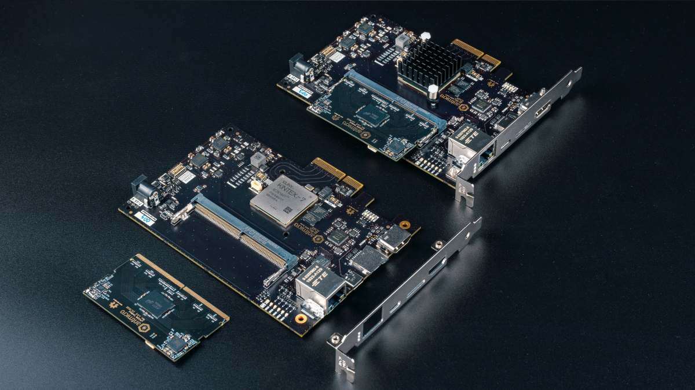
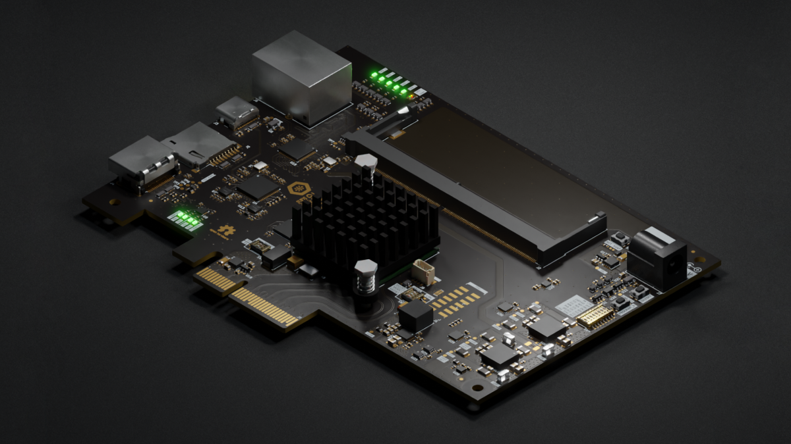
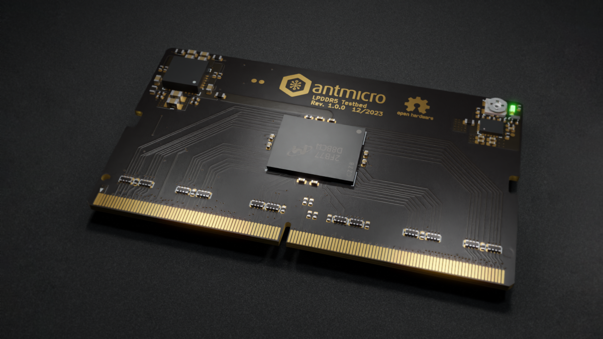

Ten years after the [first disclosure of the initial Rowhammer security exploit](https://users.ece.cmu.edu/~yoonguk/papers/kim-isca14.pdf), new DRAM vulnerabilities continue to be discovered, and developing new and efficient mitigation techniques requires a deep understanding of the problem considering the complexity of modern DRAM. To safeguard its Data Center and edge device use cases, Google has been using Antmicro’s advanced R&D capabilities to develop an [open source FPGA-based memory testing suite](https://github.com/antmicro/rowhammer-tester) and family of open hardware platforms, expanding beyond the capabilities of pure-software vulnerability testing and mitigation approaches. The targeted DDR variants have so far included [LPDDR4](https://antmicro.com/blog/2021/04/lpddr4-test-platform/), [DDR4](https://antmicro.com/blog/2021/12/open-source-data-center-rowhammer-tester/) and [DDR5 RDIMM](https://antmicro.com/blog/2022/08/extending-the-open-source-rowhammer-testing-framework-to-ddr5/).

In this blog article, Antmicro describes a new addition to the family, the latest [DDR5 Tester Board](https://github.com/antmicro/sodimm-ddr5-tester) that is compatible with both standard DDR5 SO-DIMMs and a new [LPDDR5 testbed](https://github.com/antmicro/lpddr5-testbed), also developed in this iteration of their project with Google. In principle, the SO-DIMM DDR5 Tester was developed to enable LPDDR5 Rowhammer testing, but the SO-DIMM capability is a nice addition that lets Antmicro use and test the Tester board without the need for a custom testbed.

### Rowhammer continues to be a serious threat

Although thanks to the collaborative work between universities such as ETHZ, companies like Google and Antmicro as well as memory vendors, there are now both software and hardware testing platforms targeting DDR4 and DDR5 and an array of manufacturer-led mitigation techniques, [Rowhammer continues to be a threat in all recent DRAM technologies, including DDR5](https://people.inf.ethz.ch/omutlu/pub/onur-RowHammer-UBC-Sep-20-2022-withbackup.pdf). 

Additional research has shown that Rowhammer mitigations cannot rely solely on standard solutions like ECC, but that they [need to be implemented in both hardware and software](https://memlab.ece.gatech.edu/papers/DSN_2023_1.pdf), also at the memory controller level. In fact, as part of Antmicro’s participation in the EU TRISTAN project, they are currently working on an open source and fully customizable, ASIC-ready LPDDR4 controller module, which can be equipped with custom Rowhammer and other security vulnerability mitigations. 

### Versatile memory testing platform for the DDR5 era

The Rowhammer testing suite has already supported RDIMM DDR5 used in data centers for some time, [thanks to the previously developed DDR5 board](https://antmicro.com/blog/2023/07/open-source-data-center-rdimm-ddr5-tester-for-memory-vulnerability-research/). 

However, to enable testing of LPDDR5, a [new platform had to be developed](https://github.com/antmicro/sodimm-ddr5-tester), and Antmicro  used that opportunity to incorporate several new features that were not available on the  previous baseboards into the design. 

While the previous LPDDR-focused platform in the series, the [LPDDR Tester](https://openhardware.antmicro.com/boards/lpddr4-test-board/?tab=features) featured a custom SO-DIMM pinout that made it compatible only with special testing modules designed specifically with that board in mind, the new LPDDR5 version follows the regular SO-DIMM pinout and thus is also possible to use with regular DDR5 SO-DIMM memory sticks used in desktop and some laptop platforms.

The SO-DIMM DDR5 Tester Board has been designed to function as both a standalone platform (running e.g. Linux or Zephyr, without the need for connecting it to a separate host machine) as well as an expansion board thanks to the PCIe interface described below. Besides PCIe and the (now standard) DDR5 SO-DIMM slot, as usual the board comes with both HDMI and USB-C connectors, 16Mb of flash memory, a 1Gb Ethernet RJ45 port and a microSD slot. 

As mentioned before, this is also the first DDR tester board from Antmicro that features a PCIe interface, meaning that it is possible for the SO-DIMM DDR5 Tester Board to function as a PCIe expansion card, enabling use in clusters or a real datacenter context. The addition of PCIe on top of the slower Ethernet link that was previously the main way to connect the board to an external host opens up the door to new testing possibilities, such as injecting faults over the PCIe link or dumping the contents of memory on demand. The platform also enables investigation of [the PCIe link itself for potential vulnerabilities](https://www.cl.cam.ac.uk/techreports/UCAM-CL-TR-934.pdf), which is an area of increasing interest for researchers, and a potential area where Antmicro might develop dedicated tester boards in the future. 

The other board which Antmicro have released is a newer [LPDDR5 testbed](https://github.com/antmicro/lpddr5-testbed) that is compatible with the SO-DIMM DDR5 Tester Board, specifically targeted at Micron MT60B2G8HB-48B:A 16Gb DRAM modules, commonly used in large scale commercial applications such as data centers. [The code for the open source controller](https://github.com/antmicro/litedram/tree/rowhammer-tester/litedram) has been previously developed and published on GitHub as part of our Rowhammer Tester framework. 

### Future Plans 

One of the potential developments that Antmicro is looking at for the future is adapting the board to accommodate emerging standards such as [CAMM2](https://www.jedec.org/news/pressreleases/jedec-publishes-new-camm2-memory-module-standard), approved by JEDEC in December 2023. Another potential idea is developing a new testbed integrating an interposer to enable easier swapping of memory chips and testing memory chips with an oscilloscope within a larger testing environment. 

Both the [SO-DIMM DDR5 Tester Board](https://openhardware.antmicro.com/boards/sodimm-ddr5-tester) and the [LPDDR5 testboard](https://openhardware.antmicro.com/boards/lpddr5-testbed) are available on our [Open Hardware Portal](https://openhardware.antmicro.com/) which [showcases our open hardware designs](https://antmicro.com/blog/2023/04/open-hardware-portal/) and provides a deeper dive into the board stackup, schematics, block diagram and a [full list of components](https://antmicro.com/blog/2023/10/antmicro-hardware-component-database/) used in the design.

### Custom hardware testing platforms with Antmicro

Antmicro is at the forefront of creating and expanding new open source and automated hardware and software tester solutions for its commercial customers, helping ensure the security and reliability of high-throughput interfaces like DDR or PCIe. With mitigations against Rowhammer being slow to market, comprehensive and systematic testing remains the only viable method of ascertaining whether a specific memory chip is vulnerable or not to attack due to manufacturing variances. 

If you wish to discuss the possibility of creating specialist hardware and software testing platforms for your specific needs, or if you need open source tooling for comprehensive testing of hardware for new and existing vulnerabilities, get in touch with Antmicro at [contact@antmicro.com](mailto:contact@antmicro.com).

